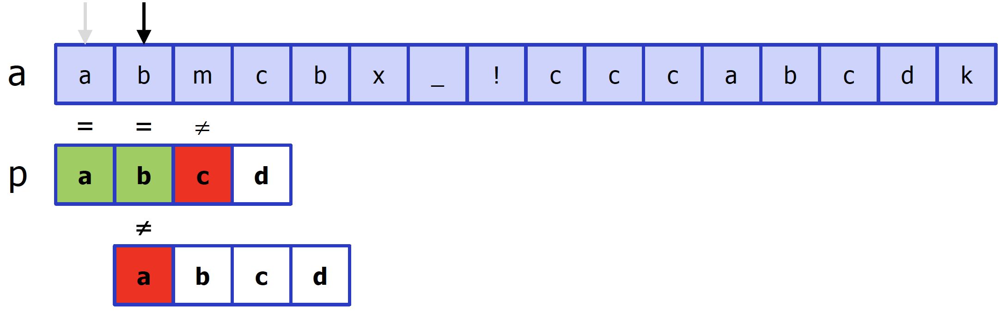
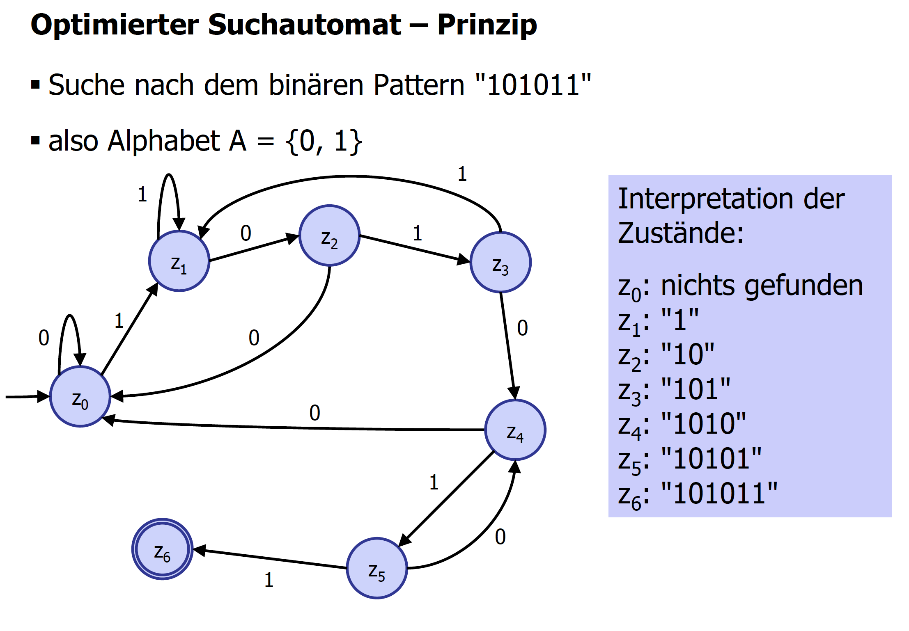
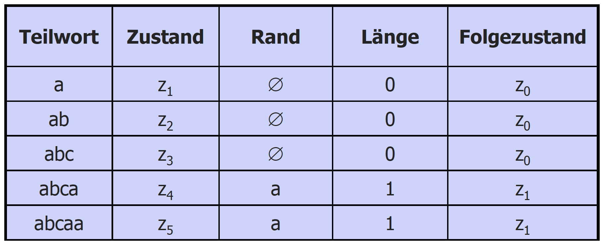
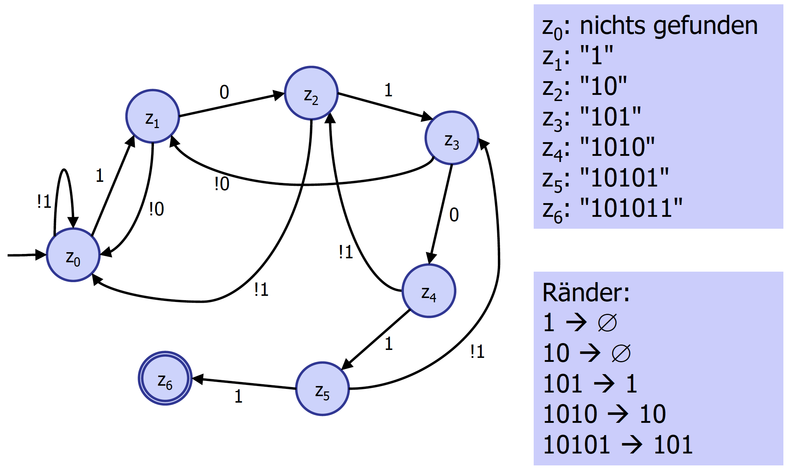
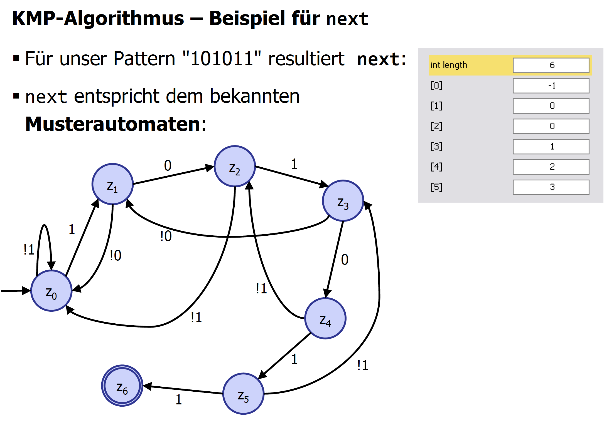
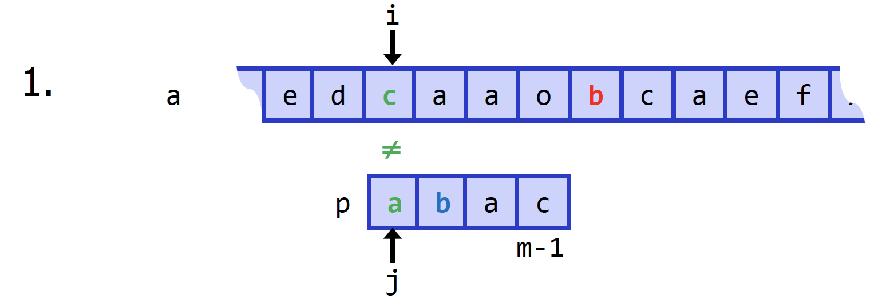
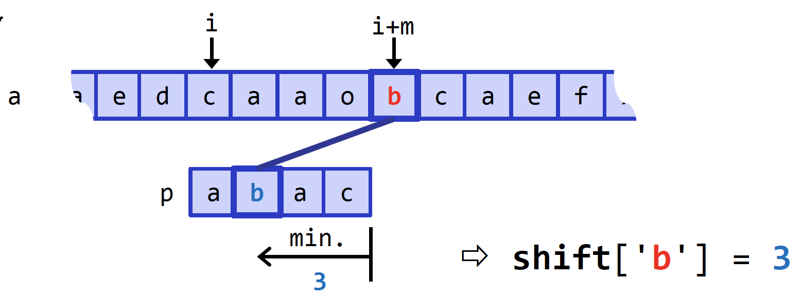
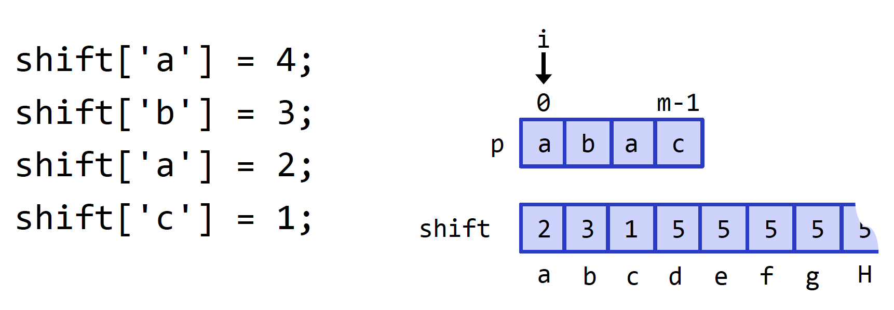
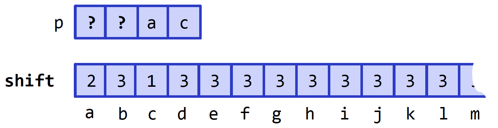
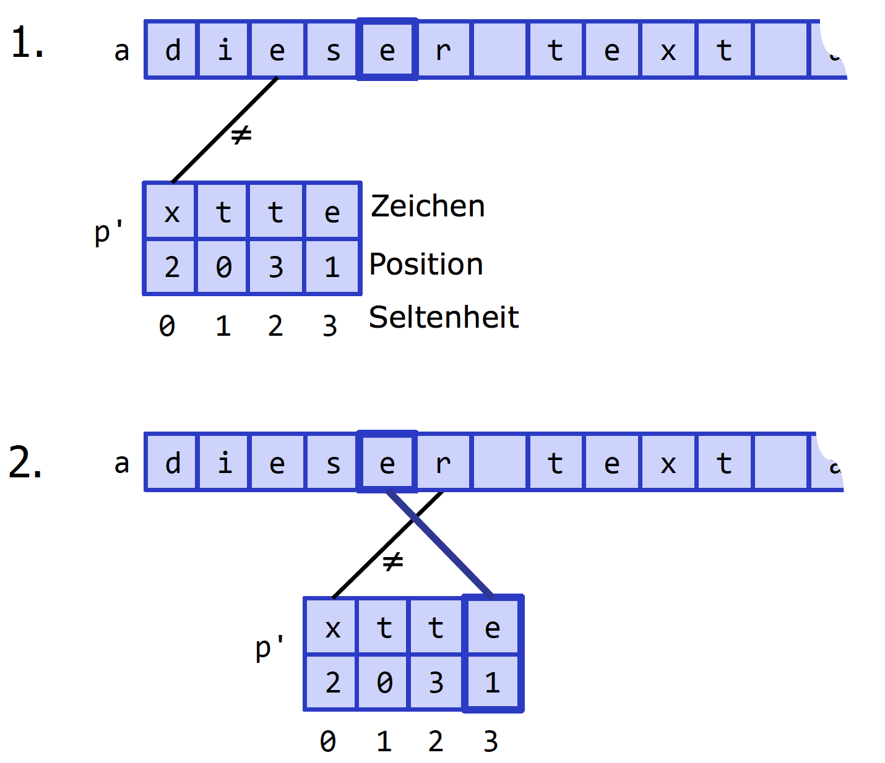

#Zusammenfassung AD

##Algorithmen Teil 2 (A4)

###Sie können die Arbeitsweise der behandelten Suchalgorithmen erklären und an einfachen Beispielen durchspielen

#### Problemstellung
**Gegeben:**

* Zeichenkette **a** (Text, String, File) der Länge **n**
* Pattern **p** (Muster, Wort, String) der Länge **m**
* Typisch: m << n

**Gesucht:**

* Index zur ersten Fundstelle von p in a (Index erstes Zeichen in a)
* Indizes zu weiteren Fundstellen in a
* Falls p in a nicht vorkommt, ist das Resultat (-1)

#### Einfache Suche

Durchsuche Zeichenkette schrittweise (vorne nach hinten).
Überprüfe jede Stelle, ob das Pattern dort vorkommt. Falls **ja**, gib den entsprechenden Index zurück, falls **nein**, gehe weiter. Wenn Pattern nirgends gefunden, gib Resultat (-1) zurück.

Im **Worst Case** kommt p in a nicht vor und man muss mit allen m Zeichen vergleichen. Laufzeitkomplexität: **O(n * m)**

Im **Average Case** wird werden Zeichenvergleiche pro Stelle durch Häufigkeit der Zeichen limitiert. Laufzeitkomplexität: **O(n)**

Jede potenzielle Fundstelle systematisch nach Pattern absuchen = **Brute Force Algorithmus**

### Suche mit optimiertem Suchautomat

Mit Zustandsautomaten kann eine Zeichenkette rein sequentiell durchsucht werden. Bereits gelesene Zeichen müssen nicht erneut gelesen werden. Laufzeitkomplexität: **O(n)**

Für Spezialfall (Alphabet nur 2 Symbole), für jeden Zustand genau zwei weiterführende Zustandsübergänge. Für Durchsuchen maximal n Zeichenvergleiche notwendig.

Optimierter Suchautomat kann nur nach dem fest einprogrammierten Pattern suchen, ist also weniger von Bedeutung.

#### Suche mit Musterautomat (KMP-Algorithmus)

Beim Musterautomat kann man durch Zustandsübergänge zu Teilworten kommen, welche einen Rand mit sich ziehen. Dieser Rand dient dazu, dass wir an einer bestimmten Stelle im Musterautomaten wieder einsteigen können, um weiter nach dem Wort zu suchen. Man unterscheidet bei der Suche zwischen je zwei Zustandsübergängen: **gewünschtesZeichen** und **!gewünschtesZeichen** (nicht-gewünschtes Zeichen).

**Definition Rand eines Wortes**: Der Rand eines Wortes ist die längste Zeichenfolge, die kürzer ist als das Wort selber und die sowohl am Anfang als auch am Ende des Wortes auftritt.

#### KMP-Algorithmus

1. Basierend auf dem Pattern p (Länge m) den Musterautomaten bzw. das Array **next erzeugen** (via Ränder)
2. Mit Hilfe von next bzw. des Musterautomaten in der Zeichenkette a (Länge n) nach dem **Pattern p suchen**.

Aufwand O(m) für Erzeugen des Musterautomaten / Aufwand O(n) für eigentliche Suche. Laufzeitkomplexität **O(m+n)**

#### Optimierter Suchautomat vs. Musterautomat

Automaten zum Suchen eines Pattern in einer Zeichenkette

**optimierter Suchautomat**

* "Manuell" konstruiert für spezifisches Pattern
* Pro Zustand mehrere "Ausgänge" möglich, führen direkt zum Zustand
* Keine !-Übergänge

**Musterautomat**

* Konstruiert mittels Ränder der Teilwörter
* pro Zustand nur zwei Ausgänge (zeichen und !zeichen)
* Spezielle Abarbeitung: ggf. für ein Zeichen mehrere Zustandsübergänge

#### Quicksearch

Schnelles Durchsuchen einer Zeichenkette **a** nach Pattern **p**. 
Ansatz ist, durch die zu durchsuchende Zeichenkette nicht kriechen, sondern springen. Bei Zeichenunstimmigkeit (**Mismatch**) zwischen Pattern und Zeichenkette sofort das Zeichen unmittelbar **nach dem Pattern** analysieren.

* Pattern **p** wird zeichenweise mit der zu durchsuchenden Zeichenkette **a** verglichen.
* Bei Unstimmigkeit wird das Vergleichen abgebrochen, potenzielle Fundstelle muss weiter rechts liegen
* Damit kommt zwangsläufig das Zeichen unmittelbar nach dem Pattern ins Spiel (**a[i+m]**) Käme im Pattern kein Zeichen b vor, liesse sich das Pattern vollständig an der Stelle b vorbei nach rechts schieben.

* Pattern lässt sich nach rechts schieben, bis das erste Zeichen darin mit b übereinstimmt (in diesem Fall um **3 Stellen**)
* Für das Verschieben: **shift-Tabelle** im Voraus erstellen (für das ganze Alphabet)

In der shift-Tabelle alle Zeichen des Pattern mit [m-i] überschreiben, damit diese bereits wissen, um wie viele Stellen sie geschoben werden dürfen:

##### Wildcards

Wildcard (**?**) ist ein Platzhalter für ein beliebiges Zeichen, sie müssen bei der Suche gar nicht verglichen werden da sie immer passen. Das rechteste Auftreten einer Wildcar begrenzt alle shift-Werte. (Ist das Zeichen ganz rechts im Pattern eine Wildcard, so schrumpfen alle shift-Werte auf 1.

##### Analyse

**Best Case**: tendiert gegen (n/(m+1) Vergleiche -> **O(n / m)**

**Worst Case**: zu einer einfachen Suche degenerieren -> **O(n * m)**

#### Optimal Mismatch

Basiert auf Quicksearch. Bei QUicksearch können Zeichenvergleiche in beliebiger Reihenfolge stattfinden. **Optimierung**: Zeichenhäufigkeit in Texten nicht gleich verteilt. Für Vergleiche zieht man im Pattern die seltenen Zeichen heran (Wahrscheinlichkeit für einen Mismatch bzw. Weiterspringen steigt an)

Pattern wird in einem Array gespeichert, dass die seltenen Zeichen am Anfang stehen. 

Oft fehlen Statistiken zur Zeichenhäufigkeit, dann sind andere Strategien gefragt:

* Pattern nach einem Mismatch reorganisieren: entsprechende Zeichen zukünftig als erstes vergleichen. Andere Zeichen verschieben sich um eine Stelle nach hinten.
* Zeichen im Pattern nur um eine Stelle nach vorn vertauschen

