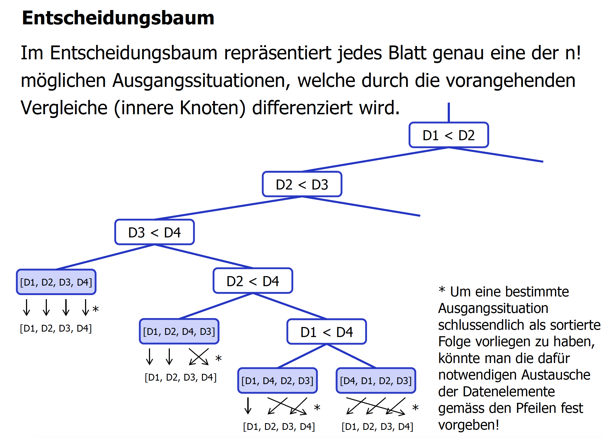
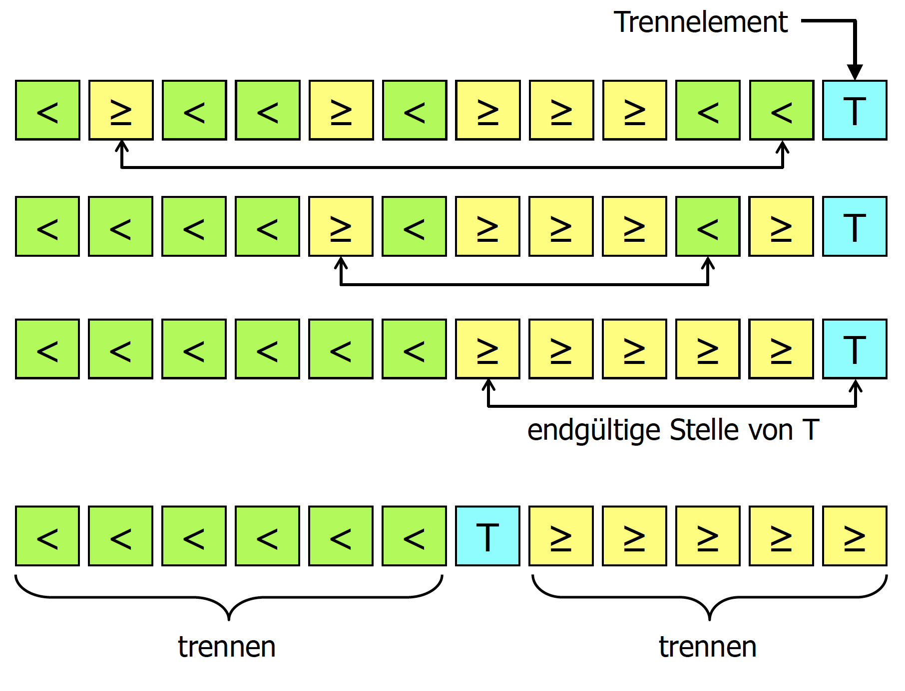
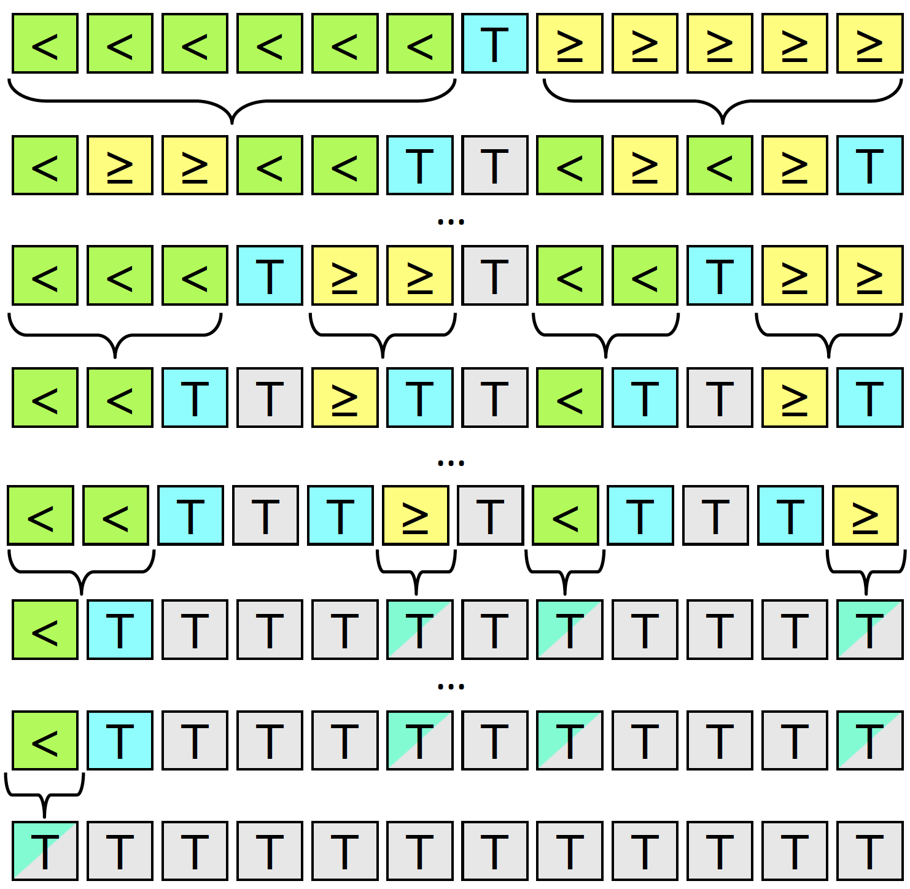
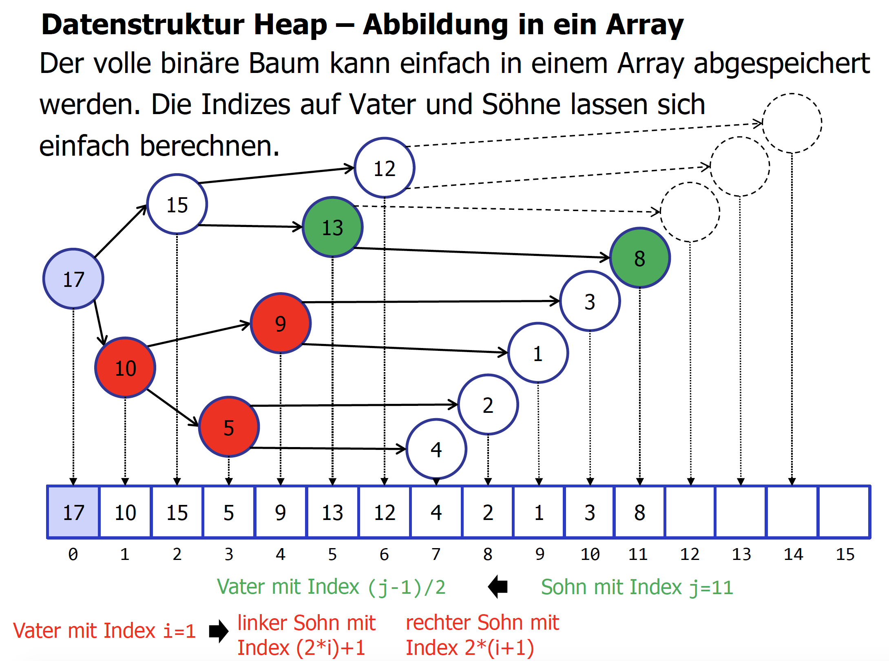

# Zusammenfassung AD
## Algorithmen Teil 1 (A1 und A2)
### Sie können die Motivation für das Sortieren darlegen
**Unordnung** (unsortiert): Späteres Suchen / Zugriff ist mühsam, lineares Suchen hat einen Aufwand von **O(n)**.

**Ordnung** (sortiert): Späteres Suchen / Zugriff ist schneller und einfacher. Binäres Suchen ("sukzsessives Halbieren") hat einen Aufwand von **O(ld n) / O(log n)**.
Beispiel hat fast 500'000 mal schnelleren Zugriff!

Effizienter Zugriff auf Daten ist essentiell in der Informatik.

### Sie kennen die Voraussetzungen und die damit verbundenen Java-Interfaces, damit man Datenelemente sortieren kann

**Totale Ordnung**, lineare Ordnung, für beliebige zwei Datenelemente x und y, es muss eine sortierte Folge festgelegt sein und Datenelemente müssen sich vergleichen lassen, es gilt:

* x ist kleiner y ODER
* x und y sind gleich gross ODER
* x ist grösser y

Zu sortierende Datenelemente müssen **vergleichbar** sein, typischerweise vergleichen anhand ihrer Schlüssel / Keys (kann ein **einzelnes Attribut** *[personID]* oder **Attribut-Kombination** *[lastName, firstName]* sein).
Java-Klasse implementiert typisch folgende Interfaces:

* **Comparable< T >** mit int compareTo(T o) für natürliche Ordnung
* **Comparator< T >** mit int compare(T o1, T o2) für spezielle Ordnung

### Sie wissen, welche Zeitkomplexität vergleichsbasierte und Radix-Sortierverfahren besitzen
**Zeitkomplexität O(g(n)) = ?**: Wie verhält sich die Rechenzeit für das Sortieren von grossen Datenmengen bei einem bestimmten Algorithmus schlimmstenfalls, wenn sich die Datenmenge z.B. verdoppelt?

* Vergleichsbasierte Sortieralgorithmen: **O(n * log n)**
* Radix-Sortieralgorithmen: **O(n)**

#### Vergleichsbasierte Sortierverfahren
Sind im besten Fall mit der Zeitkomplexität **O(n * log n)** lösbar.

Beispiel mit Datenelementen; n = 4 Datenelemente D1, D2, D3, D4. Totale Ordnung, deshalb lassen sie sich mit <, ==, > vergleichen bzw. damit ordnen/sortieren. D1 ist das kleinste und D4 das grösste Datenelement.

n = 4 heisst n! = 24 verschiedene Ausganssituationen für das Sortieren.



Mithilfe eines binären Entscheidungsbaums kann man alle n! Ausganssituationen differenzieren. Für jede Möglichkeit ein Baltt. Mit jedem inneren Knoten ist ein Vergleich verbunden.

Um alle möglichen Ausgangssituationen zu sortieren, sind entsprechend **Baumhöhe h** mindestens (h-1) **Vergleiche C** (Compares) notwendig

> C >= (h-1)

Bei Binärbäum mit **B Blättern**:

> h >= log(B)+1

B = n! gilt, es resultiert: mindestens **C >= log(n!)** Vergleiche notwendig.

> log(n!) = log(1 * 2 * 3 * 4 * .. * n/2 * .. * (n-1) * n)
> 
> log(n!) > log(n/2 * .. * (n-1) * n) // erste Faktoren weglassen!
> 
> log(n!) >> log(n/2)^n/2
> 
> = n/2 * log(n/2) = **n**/2 * **log(n**-1)

Sortierproblem bestenfalls mit **O(n * log n)** lösbar!

* ***Einfache Sortieralgorithmen*** -> **O(n^2)**: Insertion Sort, Selection Sort, Bubble Sort
* ***Höhere Sortieralgorithem*** -> **O(n * log n)**: Quicksort, Heapsort, Mergesort
* ***Sortiernetzwerke mit O(n) Prozessoren*** -> **O(log n)**: parallelisierter Mergesort

#### Radix-Sortieralgorithmen
Bedingen **spezielle Anforderungen an die Schlüssel**, finden entsprechend selten Verwendung. Eigentliches Vergleichen wird hinfällig.

Beispiel: n = 4 Datenelemente D1, D2, D3, D4. 

Als Schlüssel komme jeder int-Wert 1..n ein Mal vor (Bsp: [D1/**2**, D2/**4**, D3/**1**, D4/**3**]. 

Schlüsselwerte geben Reihenfolge für die Sortierung an: [D3/**1**, D1/**2**, D4/**3**, D2/**4**]

Radix-Sortieralgorithmen lösen das Sortierproblem bestenfalls mit Zeitkomplexität **O(n)**.

### Sie können den Unterschied zwischen internem und externem Sortieren erklären

**Internes Sortieren**:

* Daten liegen im **Arbeitsspeicher** vor.
* **Direktes Vergleichen** der Daten möglich.
* Internes Sortieren ist primär von **Bedeutung**.
* Beispiel: Sortieren von Arrays

**Externes Sortieren**:

* Daten liegen in **externem Massenspeicher** vor
* **NUR Lesen und Schreiben** möglich, kein direkter Vergleich!
* Interner Speicher ist **zu klein** für alle Daten
* Beispiel: Sortieren von sequentiellen Dateien

### Sie können anschaulich aufzeigen, was ein stabiler Sortieralgorithmus garantiert

Ausganssituation: Mehrere Datenelemente haben den gleichen Schlüssel bzw. sind gleich.

* **Stabil**: Garantiert, dass die Reihenfolge under gleichen Datenelementen nicht ändert.
* **Instabil**: Es kann passieren, dass die Reihenfolge nach dem Sortieren unter gleichen Datenelementen nicht mehr dieselbe ist wie vorher.

Beispiel wäre, wenn ein Namensverzeichnis sortiert wird. **Stabil** werden Personen mit gleichem Vornamen auch richtig nach Nachnamen sortiert. **Instabil** werden Personen mit gleichem Vornamen unter Umständen falsch nach Nachnamen sortiert.

### Sie wissen, wie man die Zeitkomplexität häufig praktisch differenziert

**Interne, vergleichsbasierte** Sortieralgorithmen sind vorallem von Bedeutung.
Massgebend sind die **Anzahl erforderlicher Vergleichsoperationen**. Rechenzeit hängt von der Anzahl n zu sortierender Datenelemente ab, aber auch die Werte können relevant sein. Man unterscheidet deshalb häufig:

* Average Case (Mittel über alle Permutationen)
* Worst Case
* Best Case (nicht besonders wichtig)

### Sie können einfache Sortieralgorithmen für kleine Datenmengen exemplarisch auf Papier durchspielen

* Direktes Einfügen (Insertion Sort)
* Direktes Auswählen (Selection Sort)
* Direktes Austauschen (Bubble Sort)
* Shellsort

#### Insertion Sort (Direktes Einfügen)

* Zu sortierendes Array wird in unsortiert und sortiert unterteilt
* Das erste Element im unsortierten Teil wird gemäss seinem Schlüssel im sortierten Teil eingefügt
* Im sortierten Teil müssen alle Elemente mit grösserem Schlüssel nach rechts verschoben werden
* Suche nach Einfüge-Position wird typisch mit Verschieben kombiniert
* nach **n-1 mal Einfügen** ist das Array sortiert

**Best Case**: Array bereits sortiert, Aufwand: **O(n)**
**Worst Case**: Array umgekehrt sortiert, Aufwand: **O(n^2)**
**Average Case**: einzufügendes Element ungefähr in die Mitte, Aufwand: **O(n^2)**

#### Selection Sort (Direktes Auswählen)

* Zu sortierendes Array wird in unsortiert und sortiert unterteilt
* Zwei Schritte: 
  * 1. kleinstes Element suchen
  * 2. Element vertauschen
  * Wird kein kleineres Element gefunden, ist das Element sortiert
* Array nach n-1 Durchläufen sortiert
* Direktes Auswählen besitzt die Ordnung: **O(n^2)**
* liegt im Worst, Best und Average Case in dieser Komplexitätsklasse

#### Bubble Sort (Direktes Austauschen)

* Zu sortierendes Array wird in unsortiert und sortiert unterteilt
* Grösster Schlüssel wird gesucht und schlägt sich an letzte Stelle durch
* Alle unsortierten Elemente werden kontrolliert, ob sie nicht aufsteigend sortiert sind, ansonst werden sie ausgetauscht (so das immer das grössere Element weiter nach rechts rutscht). Die grössten Elemente "blubbern" sich somit hoch.
* Nach n-1 Durchläufen ist das Array sortiert.
* Direktes Austauschen hat die Ordnung **O(n^2)**. *Algorithmus lässt sich so modifizieren, dass er im Best Case mit O(n) arbeitet.*
* Direktes Austauschen wird in der Praxis kaum eingesetzt.

#### Shellsort
* Verfeinerung des **direkten Einfügens**
* Sortieren in mehreren Stufen von grob bis fein
* erst über grosse Distanzen, bei der Feinsortierung (wenn noch nötig) nur noch kleine Distanzen, Prinzip aber immernoch wie beim Direkten Einfügen (blosses Austauschen nach Grösse)
* Aufwand bleibt wie bei direktem Einfügen **O(n^2)**
* Für gewisse Shell-Folgen weitaus kleinerer Aufwand 
* Hibbard-Folge: 1,3,7,15,...,2^k-1 bzw. "mal 2 + 1" -> O(n^1.5)
* Shellsort schlägt eine Brücke zwischen einfachen und höheren Suchalgorithmen

### Sie können die behandelten höheren Suchalgorithmen an einfachen Beispielen konkret "durchspielen"

### Quicksort

**Lösungsprinzip**: Teile und Herrsche

1. Problem in Teilprobleme zerlegen
2. Teilprobleme lösen
3. Teillösungen zur Gesamtlösung zusammensetzen

Quicksort ist **instabil** und besitzt im **Average Case** eine Zeitkomplexität von **O(n * log n)**.

1. Bestimme Trennelement
2. Vergleiche ein Element nach dem anderen und tausche aus, wenn linkes Element grösser ist als das rechte
3. Wiederhole Schritt, bis rechts alle grösseren Elemente als das Trennelement liegen und links alle kleineren Elemente als das Trennelement.
4. Trennelement mit dem kleinsten der grösseren Elemente vertauschen.





**Trennelement**: Idealerweise liegt es von seiner Wertigkeit her genau in der Mitte der Folge (halbier die Folge in zwei gleich grosse Teilfolgen)

**Ziele beim Trennen**:

* Trennelement steht nach Trennen an seiner **endgültigen Position**
* Alle Elemente links vom Trennelement sind kleiner diesem
* Alle Elemente rechts vom Trennelement sind grösser/gleich diesem

Nach der Trennung sollen möglichst gleich grosse Teilfolgen resultieren, aber die Bestimmung des Trennelementes soll wenig Aufwand verursachen. Zwei gängige Arten der Bestimmung des Trennelements:

* das letzte Element der Folge
* Median of Three: aus der Elementen der Folge dasjenige mit dem mittleren Wert

##### Implementation Quicksort

```
private static final void exchange(final char[] a,
		final int firstIndex,
		final int secondIndex) [
	char tmp;
	tmp = a[firstIndex];
	a[firstIndex] = a[secondIndex];
	a[secondIndex] = tmp;
}

public static final void quickSort(final char[] a, final int left, final int right) {
	int up = left;					// linke Grenze
	int down = right -1;			// rechte Grenze (ohne Trennelement)
	char t = a[right];				// rechtes Element als Trennelement
	boolean allChecked = false;
	do {
		while (a[up] < t) {
			up++;						// suche grösseres (>=) Element von links an
		}
		while ((a[down] >= t) && (down > up)) {
			down--;					// suche echt kleineres (<) Element von rechts an
		}
		if (down > up) {				// solange keine Überschneidung
			exchange(a, up, down);
			up++; down--;				// linke und rechte Grenze verschieben
		} else {						
			allChecked = true;		// Austauschen beendet
		}
	} while (!allChecked);
	exchange(a, up, right);			// Trennelement an endgültige Position (a[up])
	if (left < (up - 1)) quickSort(a, left, (up - 1));		// linke Hälfte
	if ((up + 1) < right) quickSort(a, (up + 1), right);	// rechte Hälfte, ohne T'Elt.
}			
```

### Mergesort

Mergesort arbeitet **stabil** und besitzt eine Zeitkomplexität von **O(n * log n)**.
Die Datenmenge wird halbiert und die beiden Hälften werden sortiert. 

1. Menge in zwei Hälften halbieren und auf einzelne Elemente oder Datensätze herunterbrechen
2. danach Mergen:
3. beide ersten Elemente der sortierten Hälfte Vergleichen
4. das Kleinere kopieren und dem Resultat hinzufügen (sind die verglichenen Elemente gleich gross, kopiere das Element von links)
5. den ganzen Prozess ab 3. wiederholen

**Zeitkomplexität**: O(n * log n)

**Speicherkomplexität**: O(n) -> für das Mischen wird Speicherplatz für n Elemente benötigt

#### Implementation
```
private static char[] b;

// Sortiert ZeichenArray mit Mergesort-Algorithmus
// @param a Zeichen-Array zum Sortieren
public static void mergeSOrt(final char[] a) {
	b = new char[a.length]; // zusätzlicher Speicher fürs Mergen
	mergeSort(a, 0, a.length -1);
}

// Rekursiver Mergesort-Algorithmus
// @param a Zeichen-Array zum Sortieren
// @param left linke Grenze, zu Beginn 0
// @param right rechte Grenze, zu Beginn a.length - 1

private static void mergeSort(final char a[], final int left, final int right) {
	int i, j, k, m;
	if (right > left) {
		m = (right + left) / 2;					// Mitte ermitteln
		mergeSort(a, left, m);					// linke Hälfte sortieren
		mergeSort(a, m + 1, right); 			// rechte Hälfte sortieren
		// "Mergen"
		for (i = left; i <= m; i++) [			// linke Hälfte in Hilfsarray kopieren
			b[i] = a[i];
		}
		for (j = m; j < right; j++) { 			// rechte Hälfte umgekehrt in Hilfsa. kopieren
			b[right + m - j] = a[j + 1];
		}
		i = left; j = right;					// Index für linke und rechte Hälfte
		for (k = left; k <= right; k++) { 		// füge sortiert in a ein
			if (b[i] <= b[j]) {
				a[k] = b[i]; i++;
			} else {
				a[k] = b[j]; j--;
			}
		}
	}
}	
```

#### Datenstruktur Heap (für Heapsort)

Heap: binärer Baum, der strukturelle Bedingung (er ist **voll**) erfüllt, inhaltliche Bedingung (**jeder innere Knoten >= als seine Söhne**) erfüllt und in einem **Array** abgespeichert ist. An der Wurzel befindet sich das grösste Element.



####getMax()

Entfernt Wurzel-Element, Baum muss reorganisiert werden:

1. Wurzelelement entfernen: **O(1)**
2. Blatt unten rechts zur Wurzel hoch verschieben bzw. strukturelle Bedingung sicherstellen: **O(1)**
3. Sinkprozess durchführen bzw. inhaltliche Bedingung sicherstellen (grösserer Sohn steigt auf): **O(log2n)**

Zeitkomplexität für getMax(): O(1) + O(1) + O(log2n) -> **O(log2n)**

####insert()

Einfügen eines neuen Elements, Baum muss reorganisiert werden:

1. Neues Element als Blatt unten rechts einfügen bzw. strukturelle Bedingung sicherstellen: **O(1)**
2. Steigprozess durchführen (inhaltliche Bedingung sicherstellen) vertauschen, falls Vater kleiner: **O(log2n)**

Zeitkomplexität für insert(): **O(log2n)**

### Heapsort
Heapsort ist **instabil** und besitzt Zeitkomplexität **O(n * log n)**.

**Reminder**: bei Direktem Auswählen sucht man im unsortierten Teil nach dem kleinsten Datenelement und fügt dieses an der richtigen Stelle im bereits sortierten Bereich ein.

**Heapsort arbeitet im Prinzip gleich.**

* Suchen im unsortierten Bereich beschleunigt man durch Wahl einer geschickten Datenstruktur (Heap)
* mit getMax() erfordert das Suchen nur noch O(log2n)
* gutes Zusammenspiel zwischen Algorithmen und Datenstrukturen

**Algorithmus**:

1. Heap aufbauen: Man fügt (n-1) mal mit insert() ein Element in den Heap ein.
2. Elemente sortieren: Man entnimmt (n-1) Mal mit getMax() aus dem schwindenden Heap das grösste Element. Damit resultiert die Sortierung.
3. Zeitkomplexität des Ganzen: **O(n * log n)**

Durch geschichte Implementation braucht Heapsort keinen zusätlichen Speicherplatz; Speicherkomplexität: **O(1)**

### Sie haben einen Überblick, was die Java Klassenbibliothek betreffend Sortieren bietet

#### Arrays
Klasse java.util.Arrays

* static void sort(int[] a)
* static void sort(Object[] a)
* static < T > void sort(T[ ] a, Comparator< ? super T > c)

#### Listen
Klasse java.util.Collections

* static < T extends Comparable< ? super T >> void sort(List< T > list)
* static < T > void sort(List< T > list, Comparator < ? super T > c)

#### Collection in Array umwandeln
Interface java.util.Collection< E > 

* Object[ ] toArray()
* < T > T[ ] toArray(T[ ] a)

#### Array in Liste umwandeln
Klasse java.util.Arrays

* static < T > List < T > asList(T... a)


