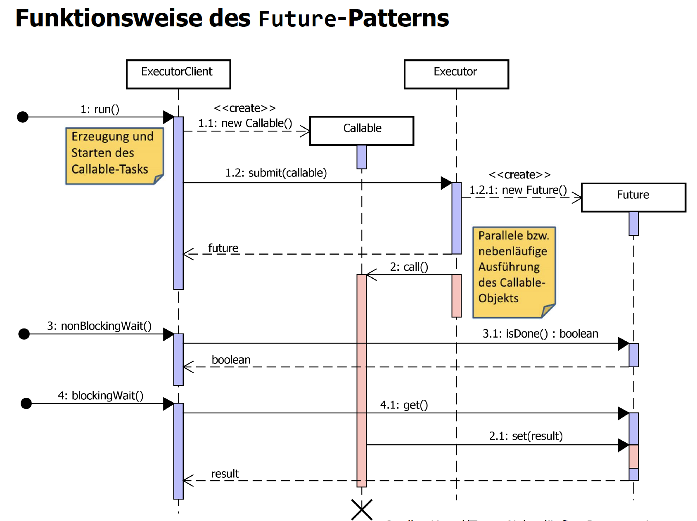
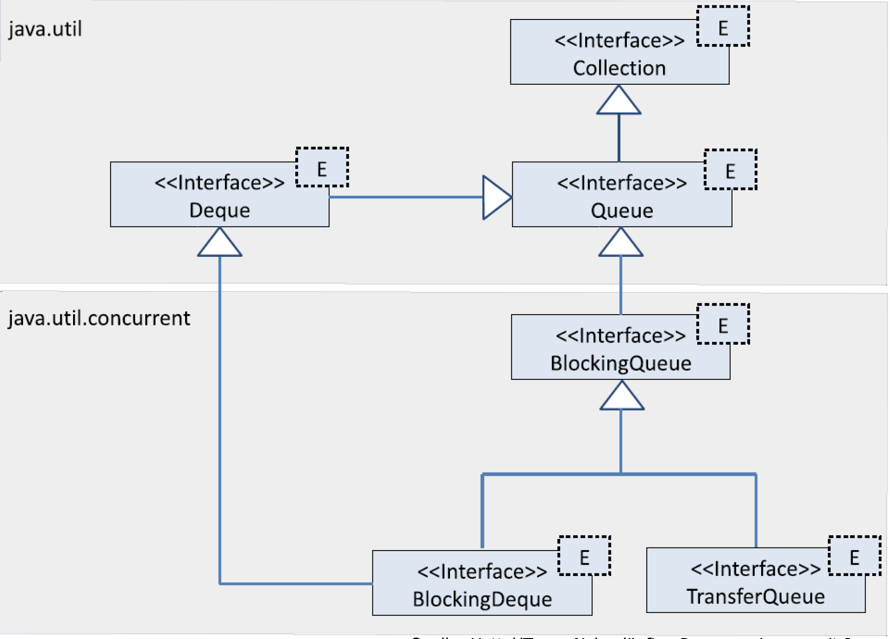
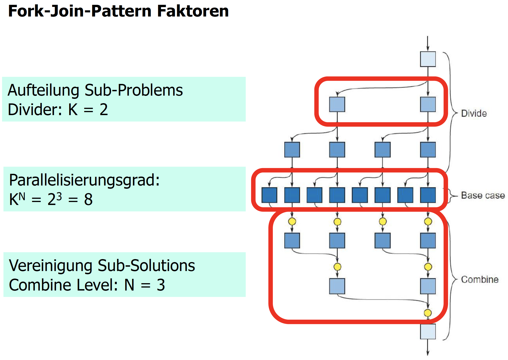
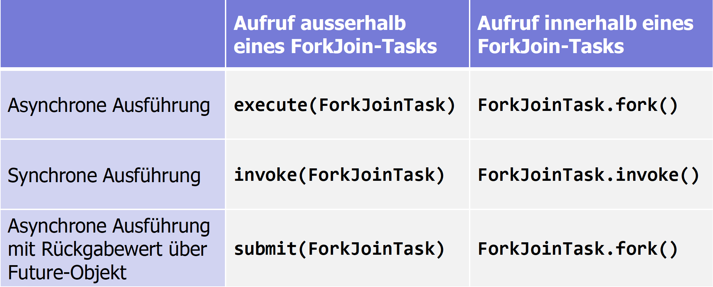

# Zusammenfassung AD
## Nebenläufigkeit
### Sie kennen Vorteile und Nachteile von Nebenläufigkeit

Vorteile

+ Steigerung der Performance
+ Zur Verfügung stehende Rechenleistung voll ausnutzen
+ Durch Auslagerung von blockierenden Tätigkeiten in seperate Threads kann die CPU in der Zwischenzeit andere Tasks erledigen

Nachteile

- Programmcode schwer zu verstehen und mit höherem Aufwand zu warten
- Erschwertes Debugging, da CPU-Zuteilung nicht deterministisch ist (bei jedem Programmstart anders)
- Parallel ablaufende Threads müssen koordiniert werden (vorallem bei Zugriff auf gemeinsame Daten)

### Sie kennen den vollständigen Lebenszyklus für Java Threads und können bestimmen, wann ein Thread sich in welchem Zustand befindet

*Auf seperatem Papier notiert*

### Sie kenne die zwei grundsätzlichen Arten, wie ein Java Thread implementiert werden soll und wissen, warum nur Runnable verwendet werden soll

Entweder mit *implements Runnable* oder *extends Thread*, also entweder durch Implementation des Interfaces **Runnable** oder Ableitung der Klasse **Thread**.
Thread muss mit der Methode *start* gestartet werden.

Runnable sollte genutzt werden, da zwischen dem Programmfluss (Thread) und der nebenläufig durchzuführenden Aufgabe (Task) unterschieden wird. Wenn eine Klasse von einem Interface erbt, ist das schöner und logischer, als wenn beispielsweise ein Rennfahrer von der Klasse Thread erbt und somit an sich ein "Thread" sein sollte.

### Sie kennen mindestens drei Arten, wie ein Java Thread beendet werden kann
* run-Methode ohne Fehler beendet
* run-Methode wirft eine Exception, welche die Methode (und somit den Thread) beendet
* Wenn System.exit aufgerufen wird
* Der Thread wird von aussen beendet (z.Bsp. durch einen Funktionsaufruf)

Ein Thread kann auch aktiv beendet werden:

* **erzwungen** (forceful cancellation) : sofortiger Abbruch 
* **verzögert** (deferred cancellation) : Abbruch beim nächsten Abbruchpunkt
* **kooperativ** (cooperative cancellation) : Thread wird gebeten sich zu beenden und muss sich dann selbst beenden, z.Bsp. durch return

### Sie können einen Thread aus einem anderen Softwareteil beenden und wissen wie die Interrupted Exception anzuwenden ist
Ein Thread kann mit der Methode stop beendet werden, was aber deprecated ist und auf keinen Fall verwendet werden sollte.
Mit der Methode **interrupt()** wird das Interrupted-Flag auf true gesetzt, was eine Unterbrechungsanforderung signalisiert. Mit **isInterrupted()** kann das Interrupted-Flag ausgelesen werden, welches true zurückgibt, wenn das Interrupted-Flag gesetzt wurde.

**Beispiel der Implementation einer** ***InterruptExeption***:

```
@Override 
public void run() { 
	// Initialisierungsphase 
	try { 
		while (Thread.currentThread().isInterrupted() == false) { 
			// Arbeitsphase 
		} 
	} catch (InterruptedException ex) { 
		// Thread wurde in einer Wartemethode unterbrochen 
	} finally { 
		// Aufräumphase 
	} 
}
```
### Sie kennen die Konzepte für den Zugriff auf gemeinsame Ressourcen und können diese anwenden

Bedingungen für den Zugriff auf gemeinsame Ressourcen:

* Immer nur ein Thread in einem kritischen Abschnitt
* Keine Annahmen über die zugrunde liegende Hardware
* Threads dürfen andere Threads nicht blockieren (ausser ein Thread befindet sich in einem kritischen Abschnitt)
* Ein Thread soll nicht unendlich lange warten müssen, bis er in einen kritischen Abschnitt eintreten kann

Mit dem Schlüsselwort **synchronized** kann der Zugriff auf den Lock eines Objekts festgelegt werden. Beispiel: ich versehe eine Funktion mit dem Schlüsselwort synchronized:

```
synchronized void bump() {
	count++;	
}

```
 
Somit kann (bzw. wird) diese Funktion von mehreren Threads verwendet, es kann jeweils jedoch nur ein Thread auf diese zugreifen.


### Sie kennen das Monitor Konzept, wissen was Reentrant sowie Nested Monitore sind und können diese vermeiden
Ein Monitor wäre eine spezielle Klasse mit folgenden Eigenschaften:

* Alle Daten der Klasse müssen *private* deklariert sein (Zugriff ist kontrolliert, nur mit Gettern und Settern)
* Nur ein Thread kann zu jedem Zeitpunkt in einem Monitor aktiv sein
* Die Sperre kann eine beliebige Anzahl von Bedingungen besitzen
* Es ist Aufgabe der VM, den wechselseitigen Ausschluss der Monitoreingänge zu garantieren

Java setzte diese Eigenschaften jedoch nicht gänzlich um (wird nicht erzwungen), denn:

* Attribute einer Klasse müssen bei Java nicht *private* sein (sie dürfen z.Bsp. auch public sein)
* Nicht alle Methoden müssen als *synchronized* deklariert sein

Folgende beiden Monitore sind Probleme, welche wir vermeiden möchten: 

* **Reentrant**: eine synchronisierte Methode ruft eine andere synchronisierte Methode auf, wobei beide synchronisierten Code Abschnitte denselben Object Lock Pool verwenden (dabei kann die erste synchronisierte Methode gar nicht mehr aufgerufen werden, da diese bereits "gelockt" ist, Beispiel auf Papier)
* **Nested**: eine synchronisierte Methode ruf eine andere auf, bei der beide synchronisierte Codeabschnitte verschiedene Objekt Lock Pools verwenden (Beispiel auf Papier)

### Sie kennen verschiedene Fallstricke bei der Verwendung von synchronized und können diese vermeiden

* Non-Volatile Zugriff auf gemeinsam benutzte Daten: Entweder Funktionen, welche die gemeinsamen Daten verändern, *synchronized* setzen, damit niemand anders die gemeinsamen Daten bearbeiten kann. 
* Gemeinsam genutzte Daten dürfen ohne *synchronized* nicht von mehreren Threads bearbeitet bzw. verwendet werden.
* Deadlock: wenn Threads gegenseitig aufeinander warten und für immer blockiert werden. Beispiel mit schwarzem Loch.

### Sie wissen was Guarded Blocks sind
Ein Guarded Block ist ein nebenläufiger Codeabschnitt, welcher durch eine Bedingung "bewacht" wird. Sobald diese erfüllt wird, kann der nebenläufige Abschnitt ausgeführt werden. 
Codebeispiel:

```
public synchronized void guardedJoy() {
	while (!joy) {
		try {
			this.wait();
		} catch (InterruptedException e) {
			/* handling... */
		}
	}
	System.out.println("Joy have been achieved!");
}
```

### Sie kennen die Regeln, die mit der Anwendung von wait, notify und notifyAll beachtet werden müssen

**wait**

````
public final void wait() throws InterruptedException
public final void wait(long timeout) throws InterruptedException
````


Wait kann mit oder ohne timeout ausgeführt werden.
Wait versetzt einen Thread in einen Wartezustand, welcher auch in diesem bleibt (solange er nicht mit *notify* oder *notifyAll* "geweckt" wird oder das Timeout abgelaufen ist, wenn eines gesetzt wurde). Eine weitere Möglichkeit ist, dass ein anderer Thread die Methode *interrupt* des Threads, welcher am "warten" ist, aufruft.

**notify / notifyAll**


```
public final void notify()
public final void notifyAll()
```

**notify** weckt einen einzigen Thread im Wartezustand. Bei mehreren Threads ist nicht vorhersehbar/bestimmtbar, welcher aufgeweckt wird. Der aufgeweckte Thread wartet danach nochmals bis er den Lock für den synchronized Abschnitt erhält. Erst dann ist er wieder bereit zur erneuten Ausführung.

**notifyAll** weckt alle an diesem Objekt wartenden Threads auf.

### Sie wissen wie ein Semaphor funktioniert

Ein Semaphor ist ein Zähler für Passiersignale.
Es kennt zwei Operationen:

* P = passeren (passieren) = down / wait / acquire
* V = verhogen (erhöhen) = up / signal / release

**p**: Anzahl abgeschlossener P-Operationen auf s

**v**: Anzahl abgeschlossener V-Operationen auf s

**n**: Initialwert, der n Passiersignale im Semaphor initialisiert.

Es gilt `s >= 0 AND s = n + v - p`

Das Semaphor kann somit immer erhöht werden. Will man jedoch etwas entnehmen, aber es ist nichts vorhanden, muss man warten. Das Semaphor müsste somit, sobald es wieder über Null ist, alle Wartenden benachrichtigen.

### Sie kennen das Thread Pool Konzept und können das nebenläufige Ausführen einer Aufgabe von der technischen Realisierung trennen
Ein Thread Pool ist eine Warteschlange / Queue, welcher Runnable Objekte übergeben werden können. Der Thread Pool arbeitet diese dann selbstständig ab, indem er eine fixe Anzahl Threads erstellt, welche diese Runnable Objekte abarbeiten. Alle Thread Pools implementieren die Methode execute() des Interface Executor, welche dann das Runnable direkt ausführt.

```
pool.execute(Runnable);
```

Mit dem Executor ist eine Entkopplung möglich, zwischen den nebenläufig ausführbaren Aufgaben und der technischen Realisierung der nebenläufigen Ausführung.

### Sie können die Executors-Klasse zur Erzeugung von Thread Pools adäquat einsetzen
Fabrikmethoden der Executors-Klasse (eine Auswahl)

**newCachedThreadPool()**

Thread Pool, wo bei Bedarf neue Worker Threads erzeugt werden. Unbenutzte Threads bleiben für 60 Sekunden erhalten.

**newFixedThreadPool(int nThreads)**

Thread Pool mit *nThreads* Threads. Die Warteschlange für die übergebenen Aufgaben ist bei diesem Pool unbeschränkt. Stirbt ein Thread aufgrund eines Fehlers, wird er durch einen neuen Thread ersetzt.

**newScheduledThreadPool(int corePoolSize)**

Thread Pool mit einem *ScheduledExecutorService*. Aufgaben werden nach einer gegebenen Verzögerung ausgeführt bzw. sie werden periodisch ausgeführt.

Bei den meisten Fabrikmethoden kann auch eine **ThreadFactory** als Argument übergeben werden:

* newCahedThreadPool(*ThreadFactory threadFactory*)
* newFixedThreadPool(int nThreads, *ThreadFactory threadFactory*)
* newScheduldedThreadPool(int coreSize, *ThreadFactory threadFactory*)

Die **ThreadFactory** ist ein Interface, das einen neuen, selbst definierten Thread erzeugt: ***Thread newThread(Runnable r)***

Einfachste Implementierung:

```
public final class SimpleThreadFactory implements ThreadFactory { 
	@Override 
	public Thread newThread(final Runnable r) { 
		return new Thread(r); 
	} 
}
```

**Grundsätzliche Empfehlungen zur Nebenläufigkeit:**

* Nebenläufigkeit kann neben Performancesteigerung auch das Programmiermodell vereinfachen.
* **Thread** und **Runnable** sollten vorallem zur Realisierung von einfachen, wenigen, langlaufenden nebenläufigen Threads verwendet werden.
* Bei vielen, eher kurzen und häufigen Threads: Konzept der **Executor-Services** nutzen! Ist einfacher, viel effizienter und mit Rückgabewerten.
* Voneinander unabhängige Aufgaben sind in der Regel völlig problemlos.
* **Synchronisation** notwendig bei Abhängigkeiten wie gemeinsame Daten(-strukturen) - ansonsten Inkonsistenzen und Fehler!

### Sie können die Anzahl Threads für eine entsprechende Aufgabe abschätzen und einen Executor entsprechend konfigurieren
Es besteht die Frage, ob eine Aufgabe eher IO-intensiv oder rechenintensiv ist. Die Anzahl der Pool Threads lässt sich mit folgender Faustregel ungefähr berechnen:

```
N(Threads) = N(CPU) * U(CPU) * ( 1 + (W/C) )
```

* **N(Threads)** : Anzahl der Pool Threads
* **N(CPU)** : Anzahl der zur Verfügung stehenden Kerne
* **U(CPU)** : Auslastung der CPU ( 0 < *U(CPU)* < 1 )
* **W/C** : Verhältnis zwischen Warte- und Rechenzeit

Für rechenintensive Tasks und Vollauslastung sollte folgendes gewählt werden: 

```
N(Threads) = N(CPU) + 1

Runtime.getRuntime().availableProcessors() + 1
```

### Sie kennen die Abstraktion der Executor-Services, Callable<V> und Future<V> und können diese nutzen
#### Zwischeninfo zu Runnable mit Rückgabewert
Eine Runnable-Aufgabe besitzt grundsätzlich keinen Rückgabewert. Soll eine Aufgabe einen Rückgabewert liefern, funktioniert dies nur mit einem "Rückgabeattribut":

```
public final class RunnableWithReturn<T> implements Runnable {
	private T returnValue; // Attribut für Rückgabewert
	private volatile Thread self;
	...
	@Override
	public void run() {
		self = Thread.currentThread();
		// Berechnung und Speicherung des Resultats ins Rückgabeattribut
		...
	}
	public T get() throws InterruptedException {
		self.join();
		return returnValue;
		// Blockierende Abfrage des Rückgabewerts
	}
}	
```
#### Callable < V > & Future < V >
Das Interface Callable kennt nur eine **call()**-Methode, ein Callable kann einen Rückgabewert haben (Typ des Rückgabewertes wird per Typparameter festgelegt.

```
// A task that returns a result and may throw an exception.
public interface Callable<V> {
	/**
	* Computes a result, or throws an exception if unable
	* to do so.
	* @return computed result
	* @throws Exception if unable to compute a result
	* /
	V call() throws Exception;
}
```

Um den Rückgabewert einer durch das Callable-Interface implementierten Aufgabe zu erhalten, benötigt man die Hilfe von **FutureTask**. FutureTask implementiert **Runnable** und kann somit einem Thread zur Ausführung übergeben werden. Über die **get**-Methode des FutureTask erhält man Zugriff auf das Ergebnis.

```
final Callable<Integer> callable = () -> {
	int sum = 0;
	for (int i = 1; i <= 10000; i++) {
		sum += i;
	}
	return sum;
	// Callable Objekt mit Rückgabewert
};

final FutureTask<Integer> futureTask = new FutureTask<>(callable);
new Thread(futureTask, "Future Task Thread").start();

LOG.info ("Summe: " + futureTask.get());
// Blockierende Abfrage des Rückgabewertes.
```
Die Methode executor.**submit**(callable) liefert ein Future-Objekt zurück. Der ExecutorService ist in diesem Fall der Thread Pool, von welchem das Callable verarbeitet wird. Das Future-Objekt kann mit **future.get()** wieder abgefragt werden und man kann somit den Rückgabewert abfangen.

```
final Future<Integer> future = executor.submit(callable);
LOG.info("Summe: " + future.get());

executor.shutdown();
```

Folgende Abbildung stellt noch einmal die Funktionsweise des gesamten Future-Patterns dar:





**Future < V >** bietet auch ***get(long timeout, TimeUnit unit)*** an, wobei eine maximale Wartezeit angegeben werden kann, bis zu welcher das Ergebnis verfügbar sein muss. Ist dies bis Ablauf der Wartezeit nicht der Fall, wird eine *TimeOutException* geworfen.

Bearbeitungsstatus mit ***isDone()***. 

Zum Abbrechen ***cancel(boolean mayInterruptIfRunning)***. Ist der Task noch nicht gestartet, wird er nicht ausgeführt. Befindet er sich mitten in der Abarbeitung, kann ein Interrupt gesendet werden. Falls das Argument *true* ist, muss der Task so implementiert sein, dass er den Interrupt berücksichtigt.

Mit ***isCancelled()*** kann geprüft werden, ob der Task abgebrochen wurde.

Aufgaben können mit Future auf verschiedene Arten an einen Executorservice übergeben werden:

* **Future<?> submit(Runnable task):**
  Das von dieser Methode zurückgegebene Future-Objekt wird verwendet, um *isDone(), cancel()* und *isCancelled()* aufzurufen (**get()** liefert bei Fertigstellung nur den Wert *null*.
* **Future<T> submit(Runnable task, T result):** 
  Hier liefert die get()-Methode des Future-Objekts das vorgegebene result-Objekt als Ergebnis zurück.
* **Future<T> submit(Callable<T> task):**
  Mit dieser Methode wird ein Future-Objekt zurückgeliefert, mit dem das Ergebnis der Berechnung abgeholt werden kann.
  
**Beispiel**: Es soll ein Array nebenläufig von einem Callable sortiert werden und als Resultat soll das sortierte Array ausgegeben werden.

```
public final class ArraySorter implements Callable<byte[]> {
	
	private final byte[] array;
	
	public ArraySorter (byte[] array) {
		this.array = Arrays.copyOf(array, array.length);
	} // Array kopieren für ein Objekt
	
	@Override
	public byte[] call() {
		Arrays.sort(array);
		return array;
		// Rückgabe des asynchron ausgeführten Tasks ist ein byte-Array
	}
}

// Array-Sortier-Task aufgeben

	final byte[] array = new byte[16];
	new Random().nextBytes(array);
	
	final Callable<byte[]> callable = new ArraySorter(array);
	final ExecutorService executor = Executors.newCachedThreadPool();
	
1.	final Future<byte[]> result = executor.submit(callable); // Arbeit an den ExecutorService übergeben
2. //...hier etwas anderes machen
3. final byte[] bs = result.get(); // Resultat abholen

	LOG.info("lowest value = "+bs[0]
	LOG.info("highest value = "+bs[bs.length-1]);
```


### Sie wissen wie Sie mit Ausnahmen in nebenläufig ausgeführten Tasks umgehen müssen

Bei **execute** wird, sobald der Task ausgeführt wird, meist eine Exception geworfen, beispielweise bei der Division durch Null:

```
final ExecutorService executor = Executors.newCachedThreadPool();
executor.execute(() -> System.out.println(1 / 0));

//Ausgabe
Exception in thread "pool-1-thread-1"
java.lang.ArithmeticException: / by zero
```

Bei **submit** wird nicht automatisch eine Exception geworfen (executor.submit()). Grund ist, dass beim Einsatz von submit jede *nicht behandelte* Exception von Runnable oder Callabe abgefangen wird. Beispiel:

```
public void run() {
	Throwable thrown = null;
	try {
		while (!isInterrupted()) {
			runTask(getTaskFromWorkQueue());
		}
	} catch (Throwable e) {
		thrown = e;
	} finally {
		threadExcited(this, thrown);
	}
}
```

Bei **get** wird Ausnahme auf das zurückgegebene Future-OPbjekt ausgelöst:

```
final ExecutorService executor = Executors.newCachedThreadPool();
final Future<?> future = 
	executor.submit(() -> System.out.println(1 / 0));
try {
	future.get();
} catch (InterruptedException | ExecutionException ex) {
	LOG.debug(ex);
}

// Ausgabe
DEBUG - java.util.concurrent.ExecutionException:
java.lang.ArithmeticException: / by zero
```

Man kann alternativ die Exception **im Task abfangen** und loggen. Die Exception sollte weitergegeben werden, damit der Aufrufende über die Exception in Kenntnis gesetzt wird:

```
final ExecutorService executor = Executors.newCachedThreadPool();
final Future<?> future = executor.submit(() -> {
	try {
		System.out.println(1 / 0);
	} catch (Exception ex) {
			LOG.debug(ex);
			throw ex;
	}
});
try {
	future.get();
} catch (InterruptedException | ExecutionException ex) {
	LOG.debug(ex);
}	
```

#### Atomic-Variablen

Lesender / schreibender Zugriff auf Variablen eines primitiven Datentyps sind in Java **atomar / nicht unterbrechbar** (Ausnahmen: long und double)
Zugriffe auf Referenzvariablen sind immer atomar (unabhängig von 32- oder 64-bit)
Auf mit **volatile** gekennzeichnete Variablen ist der Zugriff garantiert atomar.
**Jedoch** bestehen Operationen auf Variablen aus mehreren Schritten, obwohl es in Code nur eine einzige Anweisung ist. *Sind einfache Daten mithilfe von Locks geschützt, zieht dies immer einen Performanceverlust nach sich.*

Seit Java 5: **java.util.concurrent.atomic** (Paket mit Kapselungen [Wrapper Klassen] für verschiedene Datentypen)

Die gängigen Klassen daraus sind **AtomicBoolean, AtomicInteger, AtomicLong** und **AtomicReference**.
Mit Atomic-Variablen wird das "Locken" auf die Hardware delegiert (mit compareAndSet-Mechanismus).
*Wenn zwei Threads auf verschiedenen Rechenkernen gleichzeitig auf eine Atomic-Variable zugreifen, wird ein Thread den Bus blockieren und der andere muss so lange auf die Freigabe warten, was ein mögliches, jedoch sehr kurzes, Blockieren bedeutet.*

##### AtomicInteger - Compare-and-Set

**CompareAndSet-Operation** kann eine Variable atomar lesen und verändern, mit folgenden drei Angaben:

* Speicherstelle
* den erwarteten, alten Wert
* einen neuen Wert

* **boolean compareAndSet(int expect, int update)**: Befehl angewandt auf den Wert des Objekts. Stimmt der Inhalt der Speicherzelle mit dem alten Wert überein, wird der neue an die Speicherstelle geschrieben. Stimmt er nicht überein, weil er sich geändert hat, findet keine Modifikation statt. Die boolean Rückgabe signalisiert, ob eine Änderung stattgefunden hat.
* **int addAndGet(int delta)**: Der Wert wird atomar um delta erhöht. Der neue Wert wird zurückgegeben.
* **int decrementAndGet()**: Der Inhalt wird atomar dekrementiert und der neue Wert wird zurückgegeben.
* **int incrementAndGet()**: Der Inhalt wird atomar inkrementiert und der neue Wert wird zurückgegeben.
* **int set(int newValue)**: Der Wert wird durch newValue ersetzt und der neue Wert wird zurückgegeben.
* **int get()**: Liefert den aktuellen Wert.

Getter-Methoden gibt es auch in der getAnd-Version. Methoden der anderen Atomic Wrapper Klassen sehen ähnlich aus.

Beispiel eines thread-sicheren Zählers mit einem AtomicInteger:

```
public final class AtomicCounter {
	
	private final AtomicInteger counter = new AtomicInteger(0);
	
	public void increment() {
		counter.incrementAndGet();
	}
	public void decrement() {
		counter.decrementAndGet();
	}
	public int get() {
		return counter.get();
	}
}
```

#### Synchronisierte Collections

Standartisierte Container: Vector, Stack, HashTable und Dictionary. Öffentliche Methoden sind durch synchronized geschützt, was im Singlethreaded-Betrieb zu unnötigen Performance-Verlüsten führt. Bei Containern des Collection-Frameworks hat man diesen Schutz weggelassen.
Für jedes Collection-Interface steht eine öffentliche Klassenmethode von Collections zur Verfügung, die eine synchronisierte Containerfassade zurückliefert.

Beispiele der Collections, durch Collections-Methode synchronisiert:

```
List<BankAccount> list = new ArrayList<>();
List<BankAccount> syncList = Collections.synchronizedList(list);

Map<String, String> map = new HashMap<>();
Map<String, String> syncMap = Collections.synchronizedMap(map);
```

Gut geeignet für Datenstrukturen, auf die wenig zugegriffen (gelesen/geschrieben) wird. Probleme treten jedoch auf:

* Synchronisierung stellt einen Engpass dar, weil sie alle Zugriffe nur mit einem Monitor schützt.
* Reines paralleles Lesen ist nicht möglich.
* Kann leicht zu Inkonsistenzen kommen.

Nach jedem Aufruf einer geschützten Methode ist ein Thread-Wechsel möglich. Bsp: Datenstruktur wird währen einer Iteration durch nebenläufige Operation verändert, mit normalen for-Schleifen gerät die Datenstruktur sehr leicht in einen untentdeckten inkonsistenten Zustand.
Um **Thread-Sicherheit** zu gewährleisten, muss der Container selbst geschützt werden (Nebenläufigkeit wird stark eingeschränkt, da der Container für alle anderen Zugriffe gesperrt wird):

```
synchronized (syncList) 
	for (int i = 0; i < syncList.size(); i++) {
		// tu was mit syncList.get(i)
	}
}	
```

### Sie können für den asynchronen Datenaustausch zwischen Threads die entsprechende Queue-Klasse auswählen und diese nutzen

#### BlockingQueue - Hierarchie



***Wichtigste Methoden des BlockingQueue-Interface:***

* **boolean offer(E e)**
* **boolean offer(E e, long timeout, TimeUnit unit)**: Fügt Element am Ende der Queue ein. *Rückgabe*: War Operation erfolgreich oder nicht (*true/false*). Mit Timeout: *false* nach Ablauf der angegebenen Zeit.
* **E poll()**
* **E poll(long timeout, TimeUnit unit)**: Entnimmt Element am Anfang der Queue. Rückgabe: Element oder *null* (falls kein Element vorhanden oder angegebene Zeit abgelaufen)
* **void put(E e)**: Fügt Element am Ende der Queue ein & wartet (blockierend) ggf. bis entsprechender Platz in der Queue vorhanden ist.
* **E take()**: Entnimmt Element am Anfang der Queue & wartet (blockierend) ggf. bis ein Element vorhanden ist.

#### Implementierungen von BlockingQueue (eine Auswahl)

*(Mit Ausnahme von PriorityBlockingQueue (und Ableitungen) werden Elemente immer am Ende eingefügt und am Anfang entnommen [FIFO-Prinzip])*

* **ArrayBlockingQueue<E>**: Queue mit einer festen Grösse (Kapazität)
* **LinkedBlockingQueue<E>**: existiert als kapazitätsbeschränkte als auch als unbeschränkte Queue
* **DelayQueue<E>**: kann nur Objekte aufnehmen, deren Klasse das Interface **Delayed** implementiert. Für interne Organisation werden *compareTo* und *getDelay* verwendet.
* **PriorityBlockingQueue<E>**: sortiert mit *compareTo* bzw. mit explizit angegebenen *Comparator-Objekt* ihre verwalteten Elemente.
* **SynchronousQueue<E>**: blockierende Queue, beteiligte Threads müssen aufeinander warten. SynchronousQueue hat keine Kapazität.

**Praxistipps:**

* Interface Queue erweitert Collection: bietet daher die Methoden *add* und *remove* zum Hinzufügen/Entfernen eines Elements in den Container an.
* **add**: löst *IllegalStateException* aus, wenn das Einfügen nicht möglich ist (im Unterschied zu *offer*)
* **remove**: löst *NoSuchElementException* bei einer leeren Queue aus (im Unterschied zu *poll*)
* In der Praxis: Queues mit fester Grösse sind der **Normalfall**, *poll* und *offer* sollten also bevorzugt werden.

### Sie kennen das Grundprinzip des Fork-Join Konzepts

#### Nebeninfo
**Fork-Join-Framework**: für Parallelisierung von rekursiven Divide-and-Conquer-Algorithmen eingesetzt. Verwendet Thread-Pool mit Work-Stealing-Verfahren.

**Parallele Array- und Stream-Verarbeitung**: parallele Verarbeitungsmöglichkeiten für Arrays und Collections seit Java 8. Streams = Abstraktionen, welche sequentielle oder parallele Ausführung von Operationen auf Elemente einer Sequenz unterstützen.

**Completeable Future**: Erweiterung des Future-Patterns seit Java 8. Tasks mit asynchronen Ereignissen handhaben.

#### Fork-Join-Konzept

Aufteilen (**Fork**) und Vereinen (**Join**)

* **Fork**: von übergeordnetem Thread aufgerufen, um Kindthread zu erstellen (***Elternteil*** fährt nach Fork-Vorgang weiter, ***Kind*** beginnt Operation getrennt vom Elternteil)
* **Join**: wird von Elternteil und Kind aufgerufen. ***Kind*** ruft Join auf, wenn Operation beendet ist (implizit: bei Beenden des Kind-Threads). ***Elternteil*** wartet bis Kind Operation beendet hat (joins) und fährt dann fort.

*Fork* schafft Nebenläufigkeit. *Join* reduziert Nebenläufigkeit, weil das Kind beendet wird.

**Abhängigkeitsregeln von Fork-Join:**

* Elternteil muss auf Kinder warten
* Aufgeteilte Kinder vom gleichen Elternteil können in beliebiger Reihenfolge "joinen".
* Kind kann nicht mit Eltern zusammenkommen, bis es mit allen Kindern verbunden ist.

#### Fork-Join-Pattern
```
// Pseudocode
function DivideAndConquer(Problem P)
	if P:size < THRESHOLD then
		solve P sequentially
	else
		-> Divide P in k subproblems P1; P2; ... ; Pk
		-> Fork to conquer each subproblem in parallel
		fork DivideAndConquer(P1)
		fork DivideAndConquer(P2)
		fork ... 
		fork DivideAndConquer(Pk)
		join
		-> Combine subsolutions into final solution
	end if
end function
```

Kontrollfluss wird an einer dedizierten Stelle in mehrere nebenläufige Flüsse aufgeteilt (**fork**), die an einer späteren Stelle alle wieder vereint (**join**) werden. Vereinigung entspricht **Synchronisationspunkt**. Wenn alle Teilaufgaben erledigt sind, wird das Programm danach fortgesetzt.



* Auswahl der Grösse des Basisfalles ist kritisch.
* Rekursion so tief wie möglich, um viel Parallelität zu erhalten.
* Wenn Rekursion zu tief geht, wird Granularität der Teilaufgaben durch das Thread-Scheduling dominiert.
* K Aufteilungen und N Vereinigungslevels : Parallelisierungsgrad von bis zu K^(N)

### Sie kennen das ForkJoin-Framework von Java

* Threadpool **ForkJoinPool**
* Abstraktion **ForkJoinTask**
* Spezialisierte Klassen (Abstraktionen von ForkJoinTask): 
  * **Recursive Action**: Aufgaben ohne Rückgabe
  * **Recursive Task**: Aufgaben mit Rückgabe
  * **Counted Completer**: Aufgaben mit speziellem Warten auf das Ende der Sub-Tasks

Wichtige Methoden des **ForkJoinPool**:

* **void execute(ForkJoinTask<?> task)**: führt den übergebenen Task asynchron aus.
* **< T > T invoke(ForkJoinTask< T > task)**: Startet Ausführung des Tasks; es wird gewartet, bis der Task fertig ist (synchrone Ausführung). Es gibt auch **invokeAll**, wo mehrere Tasks ausgeführt werden und auf Ende aller Tasks gewartet wird.
* **< T > ForkJoinTask< T > submit(ForkJoinTask< T > task)**: Führt übergebenen Task asynchron aus und liefert ForkJoinTask-Objekt zurück, dass auch ein Future ist, mit welchem man z.Bsp. auf den Rückgabewert zugreifen kann.

**Work-Stealing-Verfahren**

Rückgrat des ForkJoin-Frameworks (Würde man für jeden anfallenden Task einen neuen Thread starten, würde dies zu einer exponentiell steigenden Anzahl von Threads führen).

Jeder Thread besitzt eigene Task-Queue, aus der er Aufträge holt/hineinstellt. ***Ist die Queue des Threads leer, holt er sich vom Ende einer anderen Task-Queue Aufgaben und bearbeitet diese*** (Mithilfe von Double-Ended-Queues [Deque])

* Tasks müssen die Methode **compute** implementieren: Durchführung der Aufteilung der Aufgabe und Verzweigung in Teilaufgaben.
* Verzweigung: Methoden **fork** und **invoke**
  * **fork** startet die asynchrone, nicht blockierende Ausführung des Tasks
  * **invoke / invokeAll** startet die synchrone, blockierende Ausführung eines bzw. mehrerer Tasks
* **join**: Abholen des Ergebnis der Verarbeitung
* von Future implementierte Methode **get**: wie **join**, wirft im Fehlerfall jedoch eine *InterruptedException* oder *ExecutionException*.

**execute, invoke, submit** dienen als Startpunkte für Divide-and-Conquer-Algorithmen.

**fork & invoke** werden innerhalb der **compute**-Methode aufgerufen und realisieren rekursive asynchrone bzw. synchrone Aufrufe.



**Code-Template für Einsatz des ForkJoin-Frameworks**: 

```
public final class SimpleTask extends RecursiveAction {
	//Attribute
	//Konstruktoren
	@Override
	protected void compute() {
		if (n <= SEQUENTIAL_THRESHOLD) {
			//Sequenzieller Algorithmus
		} else {
			//Definition von mehreren Sub-Tasks
			SimpleTask task1 = new SimpleTask();
			SimpleTask task2 = new SimpleTask();
			SimpleTask task3 = new SimpleTask();
			// task1, task2 und task3 werden asynchron ausgeführt
			invokeAll(task1, task2, task3);
		}
	}
}
```

Die **Verarbeitung** wird wie folgt gestartet:

```
final ForkJoinPool forkJoinPool = new ForkJoinPool(); 	// Threadpool erstellen
final SimpleTask rootTask = new SimpleTask(); 			// Task erstellen
forkJoinPool.invoke(rootTask); 							// Task synchron ausführen
```

Threadpool muss nicht explizit beendt werden, da Threads im ForkJoinPool die **Daemon-Eigenschaft** besitzen. Für viele Anwendungungen genügt der Common Pool, welcher beim Aufruf von invoka am Task-Objekt zum Einsatz kommt:

```
final SimpleTask rootTask = new SimpleTask();
rootTask.invoke();
```
> Vorteil:
> Ressourcen werden geschont, indem Threads während Nichtbenutzung
> langsam zurückgefahren und bei späterer Verwendung
> wiederhergestellt werden

### Sie wissen, welche abstrakte Klasse des Fork-Join Framework Sie ableiten müssen für Aufgaben mit und ohne Rückgabe

#### RecursiveAction (am Beispiel Mergesort)

Mergesort (Teile und Herrsche). Kann rekursiv beschrieben werden:

**Rekursionsbasis**: Zu sortierende Folge von *einem* Element ist sortiert.

**Rekursionsvorschrift**:

1. Zu sortierende Folge von *mehreren* Elementen in zwei Hälften teilen.
2. Sortieren der linken und rechten Hälfte.
3. Zusammenfügen der beiden sortierten Hälften zur sortierten Folge (mit Reissverschlussverfahren / Mischen [Merge])

**Splitphase** nur bis zu einer gewissen Grösse durchführen, dann auf effizientes, sequentielles Verfahren zurückgreifen.

##### Initialisierung

```
// Sortieraufgabe von RecursiveAction ableiten
public final class SortTask extends RecursiveAction

	// Attribute für Array und min./max.-Werte des zu sortierenden Bereichs
	private final int[] array;
	private final int min;
	private final int max;
	
	// Schwelle der Phase der sequentiellen Sortierung
	private static final int THRESHOLD = 5; // willkürlich festgelegt
``` 
**Zwei Konstruktoren**:

* **öffentlichen**: nimmt das Array zum Sortieren entgegen
* **privaten**: legt Array und zu sortierenden Bereich fest

**compute**: Aufteilung der Aufgabe und Verzweigung in die Teilaufgaben. Schwelle legt sequentiell auszuführenden Teil fest.

```
// REKURSIONSBASIS
@Override
protected void compute() {
	if (max - min < THRESHOLD) {
		sortSequentially(min, max);
	} else {
		// Definition von Sub-Tasks
	}
}

// Arrays.sort zum sequentiellen Sortieren
private void sort Sequentially(final int min, final int max) {
	Arrays.sort(array, min, max);
}
```

```
//REKURSIONSVORSCHRIFT
@Override
protected void compute() {
	if (max - min < THRESHOLD) {
		sortSequentially(min, max);
	} else {
		final int mid = min + (max - min) / 2;		// 1. halbieren
		invokeAll(									// invokeAll blockiert
			new SortTask(array, min, mid),			// 2. sortiere links
			new SortTask(array, mid, max)); 		// und rechts
		merge(min, mid, max); 						// mergen
	}
}	
```

```
// MISCHEN MIT DEM REISSVERSCHLUSSVERFAHREN
private void merge(final int min, int mid, int max) {
	// Arrays.copyOfRange kopier die Arrayelemente von min bis mid-1 ins Hilfsarray
	int[] buf Arrays.copyOfRange(this.array, min, mid);
	int i = o;
	int j = min;
	int k = mid;
	while (i < buf.length) {
		if (k == max || buf[i] < this.array[k]) {
```

> Vergleiche die beiden Elemente i und k der sortierten Hälften vom Hilfsarray und Array.
> Falls **k == max** ist, sind noch Elemente im Hildsarray und müssen
> ins Array zurückkopiert werden. 

```
	// Kopiere das Kleinere und füge es demn Array an der Stelle j hinzu.
	// Falls die Elemente gleich sind, so kopiere das Element vom Array.
			this.array[j] = buf[i];
			i++;
		} else {
			this.array[j] = this.array[k];
			k++;
		}
		j++;
	}
}	
```

**Zur Sortierung wird benötigt**:

* Integer Array
* ForkJoin-Threadpool
* Task zur Zufalls-Initialisierung des Integer Arrays
* Task zur Sortierung
* beide Tasks werden jeweils mit invoke dem ForkJoin-Threadpool übergeben (invoke ist blockierend)

```
final int[] array = new int[42]
final ForkJoinPool pool = new ForkJoinPool();
// Initialisierung des Array...
final RandomInitTask initTask = new RandomInitTask(array, 100;
pool.invoke(initTask);
LOG.info(Arrays.toString(array));
// Sortierung des Array...
final SortTask sortTask = new SortTask(array);
pool.invoke(sortTask;
LOG.info(Arrays.toString(array));
```

#### RecursiveTask (Parallelisierung des Checks auf Sortierung)

Sicherstellung für korrektes Arbeiten des Sortierungsverfahren mit Sortiercheck des Arrays.

**Rekusrionsbasis**: zwei benachbarte Elemente mit boolescher Operation prüfen.

**Rekursionsvorschrift**:

1. Teilen der zu prüfenden Folge von Elementen in zwei Hälften.
2. Prüfebn der linken und rechten Hälfte.
3. Boolesche Addition der beiden Resultate

```
// REKURSIONSBASIS
@Override
protected Boolean compute() {
	boolean result = true;
	if ((max - min) <= THRESHOLD) {
		// prüft array von min bis max-1
		for (int i = min; i < max; i++) {
			if (array[i] > array[i + 1]) {
				result = false;
				break;
			}
		}
	} else {
		// Definition von Sub-Tasks...
	}	
```

```
// REKURSIONSVORSCHRIFT
@Override
protected Boolean compute() {
	boolean result = true;
	if ((max-min) <= THRESHOLD) {
		// Definition sequentielle Berechnung
	} else {
		final int mid = min + (max - min) / 2;
		final CheckTask taskLeft = new CheckTask(array, min, mid);
		// taskLeft asynchron starten
		taskLeft.fork();
		final CheckTask taskRight = new CheckTask(array,mid+1,max);
		// taskRight synchron starten & join blockiert (wartet auf Rückgabewert von taskLeft)
		result = taskRight.invoke() && taskLeft.join();
	}
	return result;
}
```

#### CountedCompleter (Parallelisierung der Suche)

Elemente in nicht-sortierten Arrays lassen sich suchen.
**Aber:** Man will die Suche beenden, wenn das gesuchte Element gefunden wurde.

##### Erweiterungen von CountedCompleter
Tasks können mit Hilfe eines Zählers manuell verwaltet werden. CountedCompleter bietet Methoden für das explizite Beenden einer parallelen Berechnung an:

* **void addToPendingCount(int delta)**: erhöht den internen Task-Zähler
* **void tryComplete()**: signalisiert, dass ein Task beendet ist
* **void quietlyCompleteRoot()**: signalisiert dem Root-Task, dass ein Ergebnis vorliegt und er seine Blockierung aufheben kann.
* **E getRawResult()**: stellt das Ergebnis der Berechnung bereit. Ist kein Ergebnis vorgesehen, wird **void** zurückgegeben.

##### Initialisierung

```
// von CountedCompleter ableiten und Integer für Index des gefundenen Elements
public final class SearchTask extends CountedCompleter<Integer>

	//Attribut für Suchschlüssel sowie gleiche Attribute wie Sortierung und Sortiercheck
	private final int key;
	private final int[] array;
	private final int min;
	private final int max;
	
	// Schwelle für Phase der sequentiellen Suche
	private static final int THRESHOLD = 5;
```

**Zwei Konstruktoren**:

```
// public: regulärer Ausdruck als Parameter & zu durchsuchendes Array
public SearchTask (final int key, final int[] array)

//private: in public und compute genutzt, Parameter parent als Referenz auf Erzeugertask
private SearchTask(
		final COuntedCompleter<?> parent, final int key,
		final int[] array, final int min, final int max,
		final AtomicInteger result){
	super(parent);
	// weitere Inits 
```
Beim Aufruf von **quietlyCompleteRoot** kann intern das Completed-Signal zum Root-Task durchgereicht werden.

Suchergebnis wird nebenläufig ermittelt, deshalb wird es in einem **AtomicInteger** Attribut verwaltet. Das Suchergebnis wird im **public** Konstruktor initialisiert (mit -1 = kein Element gefunden). **getRawResult** stellt das Ergebnis der Suche bereit.

```
private final AtomicInteger result;

public SearchTask(final int key, final int[] array) {
	this(null, key, array, 0, array.length,
		new AtomicInteger(-1));
}

@Override
public Integer getRawResult() {
	return result.get();
}
```

**Rekursion der Suche:**

```
// REKURSIONSBASIS

@Override
protected void compute() {
	if ((max - min) <= THRESHOLD) {
		// sucht im array von min bis max-1
		for (int i = min; i < max; i++) {
			// Suchergebnis beim Index i gefunden
			// Suchergebnis beim Resultat setzen, der Anfangswert von result ist -1
			if (array[i] == key && result.compareAndSet(-1, i)) {
				// Completedsignal zum Root-Task durchreichen
				this.quietlyCompleteRoot();
				break;
			}
		}
	} else {
		// Definition von Subtasks
	}
}
```

```
// REKURSIONSVORSCHRIFT
// Teilen der Folge in zwei Hälften, Suche in beiden Hälften starten

@Override
protected void compute() {
	if ((max - min) <= THRESHOLD) {
		// Definition sequentielle Berechnung
	} else {
		final int mid = min + (max - min) / 2;
		// Framework explizit neue Tasks mitteilen, VOR dem Task-Start
		this.addToPendingCount(2);
		final SearchTask taskLeft = 
			new SearchTask(this, key, array, min, mid, result);
		taskLeft.fork();
		final SearchTask taskRight = new SearchTask(this, key, array, mid, max, result);
		taskRight.fork();
		// taskLeft & taskRight: werden asynchron bearbeitet
	}
	this.tryComplete;
}
```

##### Optimierungen
Anstatt zwei Tasks starten und nichts mehr tun - nur einen mit **fork** starten und den zweiten direkt mit **compute** starten und auf Resultat warten.
Es müssen nicht zwingend zwei Tasks gestartet werden. Eine Aufgabe kann iterativ in Sub-Tasks aufgeteilt werden. Jeder Sub-Task wird gezählt und mit **fork** gestartet. Für parallele Stream-Verarbeitung bietet sich diese Art der Verarbeitung an. **CountedCompleter** wurde im Wesentlichen dafür entwickelt.