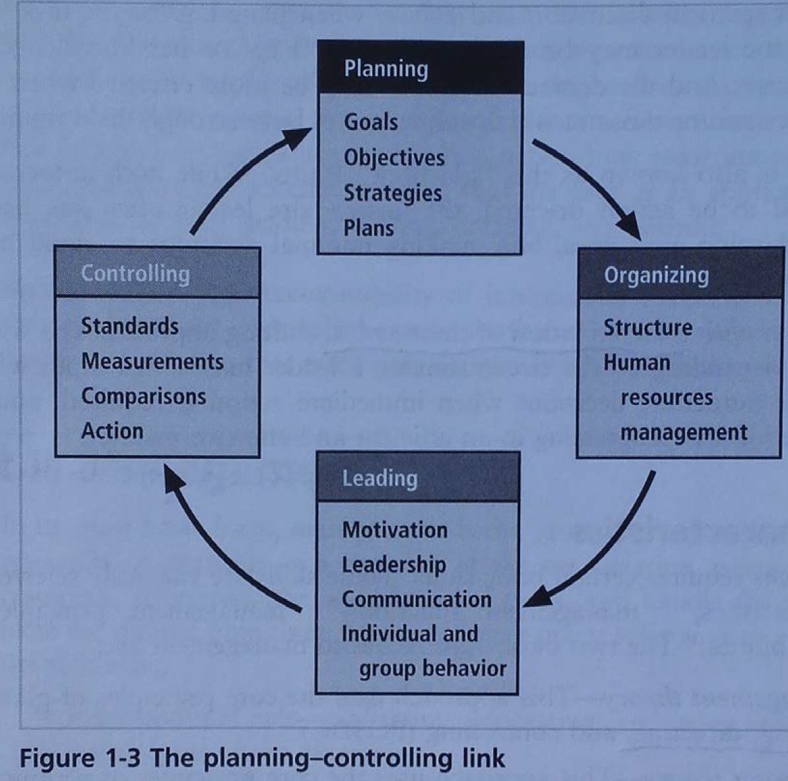
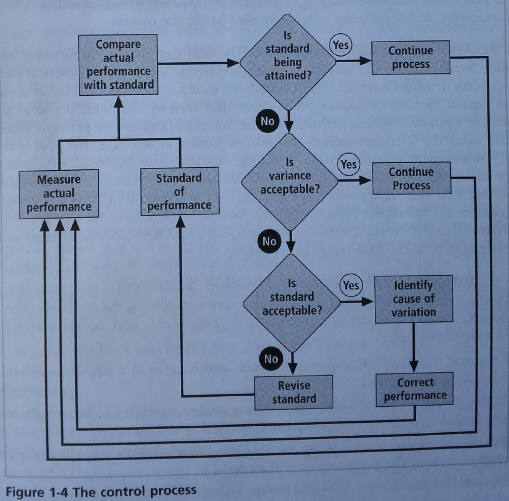
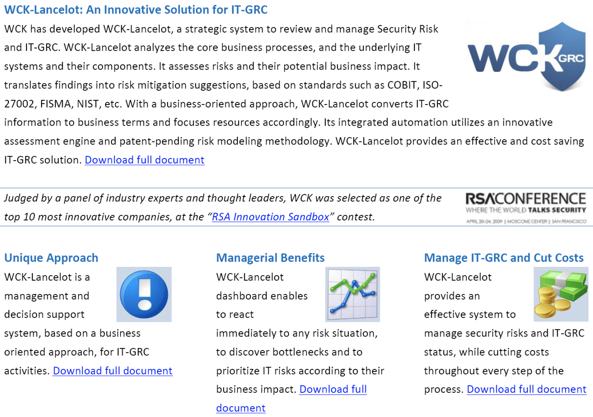

# MANSEC - Zusammenfassung

## Einführung in Information Security Management

### Definitionen

Sicherheit = CIA ; Non-Repudiation = nR
>**CIA**:
>Confidentiality, Integrity and Availability
>
>(Vertraulichkeit, Integrität/Vollständigkeit, Verfügbarkeit)

**Triple "A"**: Authentication, Authorization, Accounting

### Dimensionen

* Legal, Organisatorisch, Menschlich (inkl. Usability) und Technologisch
* **Management**: Managers (Kategorien) und Gemeinschaften
* **Organisation** (Hierarchie, Entscheidungsträger, Rollen von Technikern/Ingenieuren)
* **Information** (gestern, heute, morgen) -> Zukunftsprojektion
* Sicherheit & Sicherheits**gefühl** -> wie schliesst man die Lücke?
* **Handelnd**: Maschine vs. Mensch

### Management

* Rollen von Managern (Informierend, Interpersonell, Entscheidend)
* Führer (Leadership) und Manager: Unterschied?
* Arten von Führern (artocratic, democratic, laissez-faire)

**Managementcharakteristiken**:

**POSDC**: planning, organizing, staffing, directing, controlling (MBA, traditional)

**POLC**: planning, organizing, leading, controlling (important for CISO)

**Planning**: strategic, operational, tactical

### Problemlösungsprozess

1. Erkenne und definiere das Problem
2. Sammle Fakten und stelle Vermutungen auf
3. Entwickle mögliche Lösungen
4. Analysiere und vergleiche mögliche Lösungen

**Abbildung**: Abweichungen korrigieren

### Grundsätze des Information Security Managements

1. Planung / Planning
2. Strategie / Policy
3. Programme / Programs
4. Schutz / Protection
5. Projekte

### Managing People - Technology Development Process
#### Charakteristiken des Personals in Beziehung zum Prozesszyklus

* **Inventor (Erfinder)**: Persönlichkeiten vom "Go West Type", kreativ, akzeptieren keine Grenzen oder Einschränkungen *(Happy that we can... that it works...)*
* **Early Adapters and Evangelists**: Erste Integration, Experten, diese Personen haben eine Mission
* **Orderly Character**: Einbindung und Verbreitung der Technologie auf geregelte Art ist das Hauptziel, immer noch etwas Kreativität
* **Bureaucratic Character**: Möchte seine Arbeit meistern. Tabellen, Listen und Kontrollen sind die Hauptwerkzeuge. Überprüfungstyp.
* **Purity Character**: Besser kein System anrühren als etwas zu riskieren (vgl. Nuklearenergie)

Diese Technologie spielt bei diesen Charakteren keinen Einfluss (Autos, Nuklearenergie, Computer, Sicherheit, ...)

### Trends in Industrie und Nachforschung

Die Philosophie der Information Security hat sich in der Vergangenheit häufig geändert. 

1. vor 1985: **Feasibility**: Froh dass das System läuft, optimiere Verfügbarkeit
2. bis 1992: **Hard Core Crypto Approach**: IT-Security = Verschlüsselung (Technikerproblem)
3. bis 1995: **Task Delegation, not Risk!**: IT-Security wird an den Security Officer delegiert
4. bis 1999: **Risk Owner takes Responsibility (funding)**: IT-Security ist Problem des Chefs
5. bis 2002: **QM Approach: At the end will be turn out well** Prozessorientierte IT-Security
6. ab 2000: **Risk Based / Risk Management Approach**: Security wird vom Security Officer vorgeschlagen und vom Business Line Manager entschieden. "Commander in Charge Model": Nutzenorientiert, Anpassung an aktuelle Risiken.
7. ab 2003: **Reduction to legal demands**: Unternehmen haben wenig Geld, Gesellschaft fühlt sich nicht potentiell bedroht. Reduzierung auf Gesetze und Rahmenwerke (Governance & Compliance Issue)
8. ab 2003: **SOX compliance demanded for US dealt stocks**: Security Controlling: separate Pflicht
9. ab 2000: **Decay of Enterprises Security Capabilities, Focus on Core Business**: Sicherheit in gemischten Besitzesumgebungen: IT ist teilweise überbelegt ohne vollständiges Bewusstsein zur Sicherheit.
10. ab 2003: **Digital Forensics**: Erste Welle der Ausbreitung der Gerichtsmedizin
11. seit 2008: **Operating under attack**: Es gibt keine angriffsfreie Zeit (begann früh in 2004)
12. seit 2009: **Digital online forensics / forensic readiness**
13. seit 2010: **Strategic efforts on SCDA security**
14. seit 2011: **Implementation of CIP and Cyber defense plans**
15. seit 2012: **Cloud computing as enlarged outsourcing: no way of return.** Die Rolle des CISO soll / muss neu definiert werden. Organisatorische, rechtliche und sicherheitskulturelle Themen werden das Security Office dominieren. Loyalität muss neu definiert und verbessert werden (die ultimative Challenge in einer wachsenden "Hire and Fire" Umgebung.
16. seit 2013: **"Crown Jewel Projekte"**: Wir können die IT nicht sicher machen (Edward Snowden) -> Resilience/Belastbarkeit, BCM, DRP (Disaster Recovery)
17. seit 2014: **Risked based security investments in CIIP, Cyber defense, SCADA-sec and "Crown Jewels"**: Notwendigkeit von Sicherheit wurde erkannt, das Budget erlaubt jedoch nicht schnell zu reagieren; nur wenige Extrabudgets werden erlaubt.
18. seit 2014: **Scenario and case based correlated log evaluation**: Unternehmen und Administrationen wollen ihre Umgebung in möglichst kurzer Zeit nach spezifischen Szenarien überprüfen können; voraussagend & reaktiv
19. seit 2015: **Multi-surveilance** muss angenommen werden; Grossinvestitionen in Sicherheitsnachforschung in SCADA, OS, confidentiality, CIIP. Cyber defense & attack: weltweiter Wettbewerb um Informationsdominanz. US, RU, China, D, GB, F, Korea, Taiwan, ... konkurrieren.
20. seit 2016: **Cyber Occupation & Cyber Sovereignity** sind Hauptsorgen. Programme wie contractual Public-Private-Partnership cPPP kommen, um den europäischen Markt zu stimulieren.
21. ...
22. **Reshaping surveillance or revolution**: Bürger werden *data space ruling* nicht mehr akzeptieren (könnte vor 2020 passieren);
23. zur gleichen Zeit: **Nationalization of IT**: Versüche, um politische Cybergrenzen aufzubauen z.Bsp. China; VPN und Proxy? 

### Basic Information Security Technologies

**[Beispiel von WCK Lancelot]**

**GRC Governance Risk and Compliance** (Regierungsrisiko- und Erfüllung?)

* Sicherheitscockpit
* Globale und verbündete IDM (wofür steht IDM?)
* Entitlement Management (sichert die Cloud)
* Business Continuity Management
* The internal thread
* Security Development Life Cycle (SDLC)
* Audit

**Security Engineering**

* Application Security SDLC
* Component based securitry improvement
* Coordinated Log Evaluation
* Security in virtualized enviroment
* The internal and global thread
* Computer attack and defence

#### Der neue Security Officer 2016++

Die **Rolle eines Security Officer** wird sich entwicklen:

* Gebildet in Technologie
* Zertifiziert (CISSP (empfohlene Referenz), CISA, CISM, etc.)
* Vertraut mit Rahmenwerken, Gesetzen und Regulierungen: macht IT "compliant" (gefügig, konform)
* Organisation: fähig, gemäss den benötigten Rahmenwerken zu testen

Was ist einem Security Officer heute **von Bedeutung**:

**Vorausssetzungen**

* Zertifiziert, i.e. gebildet in Technologie, Rahmenwerken, Organisation und Audit
* Persönlichkeit (authentisch und glaubwürdig)
* Fähigkeit, zu kommunizieren
* Versteht das Kernbusiness der Firma
* Überbetriebliche Akzeptanz und Glaubwürdigkeit
* Fähig das machbare zu erledigen und sich in einer Risikosituation nicht zu beschweren oder verzweifeln

#### Ist die Qualität eines Security Officers heutzutage messbar?

**Voraussetzungen**:

* Zertifizierung (sollte bei allen gleich sein)
* Unterschied macht: Auswirkung, Wirksamkeit
 * Persönlichkeit (authentisch und glaubwürdig)
 * Fähig zu kommunizieren
 * Versteht das Kernbusiness der Firma
 * Überbetriebliche Akzeptanz und Glaubwürdigkeit
 * Fähig das machbare zu erledigen und sich in einer Risikosituation nicht zu beschweren oder verzweifeln

**Ja, sie ist messbar**:

* Fragenkatalog (Akzeptanz, Kommunikationsfähigkeit)
* Auswirkung pro ausgegebenen CHF
* **Ziel ist, Multi-Unternehmen-Support für akzeptierte Evaluation der Wirksamkeit**
* **führt zu Fortschritt im praktischen Security Management**

### Conclusion (nach Hämmerli)

1. Security is approaching the bureaucratic and purity phase.
2. Organisational issues: Major tools are risk assessment methodology, standards
and frameworks for governance and compliance.
3. Technical issues: Security system integration (e.g. log correlation), improved
security management tools up to security cockpit, new and improved security systems components. 
4. Outsourcing of security is unavoidable for SME. Large companies outsource
security in granular steps without noticing it.
5. The security office is
-promoter, coach, communicator of the security messages as well as police. -changing from a technocrat to a business enabler.-mastering laws and regulations (better know them before)
6. Risk Control is a kind of “quality assurance of risk management”.
7. The security dimension of new trends must be studied well:
**SCADA Security, Application Security, Mobile Device Security, IDM and Entitlement Management, Outsourcing, Internal Crime, Data Leakage Prevention, Virtualization Security, Cloud Security, USB AutoRunSecurity, PDF Security ...** Measurement of soft factor security (effectiveness, communication skills etc.) are important for progressing in information security management. It could be also a mean to avoid the nomination of weak security officer to give free hands to the CIO ...)
8. The CISO job will change dramatically again, when corporation just use cloud
services. Still IT-Security remain in the company, but with more human and organizational tasks.

