#MEDTECH: Zusammenfassung
##1. Märkte für Medizinprodukte
###Life Science Engineering
(Schnittpunkt zwischen Ingenieurswissenschaften und Lebenswissenschaften)

* Pharma
* **Medizintechnik**
* Food
* Kosmetik

###Medizintechnik

Medizintechnik ist ein Fachgebiet am Schnittpunkt von Medizin und Ingenieurswissenschaften. **Übertragung technischen Wissen** auf medizinische Untersuchungsmethoden, Therapieverfahren und weitere Gebiete.

Ziel: **Optimierung der Behandlungsergebnisse** des Patienten und **Erleicherung der Arbeit** für medizinisches Fachpersonal.

####Medizinprodukterichtlinie 93 / 42 / EWG
> M5 "Medizinprodukt": alle einzeln oder miteinander verbunden verwendeten Instrumente, Apparate, Vorrichtungen, Software, Stoffe oder anderen Gegenstände, einschliesslich der vom Hersteller speziell zur Anwendung für diagnostische und/oder therapeutische Zwecke bestimmten und für ein einwandfreies Funktionieren des Medizinprodukts eingesetzten Software, die vom Hersteller zur Anwendung für Menschen für folgende Zwecke bestimmt sind:
> 
> - Erkennung, Verhütung, Überwachung, Behandlung oder Linderung von Krankheiten;
> - Erkennung, Überwachung, Behandlung, Linderung oder Kompensierung von Verletzungen oder Behinderungen;
> - Untersuchung, Ersatz oder Veränderung des anatomischen Aufbaus oder eines physiologischen Vorgangs;
> - Empfängnisregelung,
> 
> und deren bestimmmungsgemässe Hauptwirkung im oder am menschlichen Körper weder durch pharamakologische oder immunologische Mittel noch metabolisch erreicht wird, deren Wirkungsweise aber durch solche Mittel unterstützt werden kann.

Medizinprodukte		| Arzneimittel		
:--						|:--				
**Industrie**			|				
heterogene Branche | homogene Branche
**Produkte** | 
wirken überwiegend physikalisch | wirken pharmakologisch, immunologisch oder metabolisch
kurze Produktlebenszyklen | ausgedehnte Produktlebenszyklen
intensives Anwendertraining | Anwendertraining wenig intensiv
hohe Vertriebskosten | geringe Vertriebskosten
**Gesetzliche Bestimmungen** | 
Neue Konzeption: erhöhte Eigenverantwortung der Hersteller | Alte Konzeption: vorschreibender Ansatz
Konfirmitätsbewertungsverfahren nach Risikoklasse | staatliches Zulassungsverfahren

###Teilmärkte der Medizintechnik / Entwicklung bis 2020
Teilmärkte:

* Diagnostic Imaging
* Orthopedics
* General & Plastic Surgery
* Drug Delivery
* Wound Management
* **In Vitro Diagnostics (IVD)**
* **Cardiology**
* Ophthalmics
* Dental
* Endoscopy

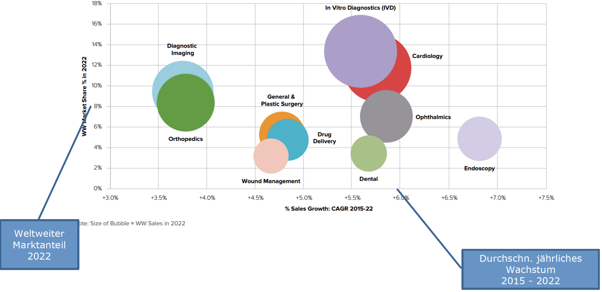

**Brasilien, Russland, Indien und China**: neue geografische Märkte, grösstes absolutes Wachstum, niedrige Herstellkosten / R&D

###Bedürfnisse in Schwellenländern (Pyramide)
**Globale Premium-Produkte:**

* Wohlhabende Konsumenten
* Zugang zu hochwertiger Gesundheitsfürsorge
* Hohe Kosten / High-End-Lösungen
* Westliche Technologie / Angebote

**Lokale Produkte:**

* Wachsendes Mittelklasse-Segment
* Eingeschränkter Zugang zu Gesundheitsfürsorge
* Rentable / erschwingliche Lösungen
* Angepasste Technologie / Angebote

**Disruptive billige Produkte:**

* Ländliche Konsumenten
* Keinen oder sehr limitierten Zugang zu Gesundheitsfürsorge
* Günstigste Lösungen
* Disruptive Angebote

**Weltweite Trends im Gesundheitswesen:**

* **Weniger Behandlungen**: Stagnierende Wirtschaft, vermehrte Zuzahlung durch Patienten
* **Knappere Staatshaushalte**: Kleinere Gesundheitsbudgets, weniger Forschungsförderung
* **Kostendruck auf Gesundheitsanbieter**: Kaufen vermehrt gebündelte Angebote, MP-Hersteller übernimmt Verantwortung für medizinisches Ergebnis
* **Weniger invasive Behandlungen**: Medikamente statt chirurgische Behandlung
* **Strengere Regulierungen**: USA, China, Europa: Entwicklungskosten eskalieren, insbesondere für kleine Unternehmen
* **Neue Technologien**: Niedrigere Operationskosten; schnellere Heilung, Technologie-Wettkampf bleibt intensiv
* **Personalisierte Medizin**: Individualisierte Medikation / Behandlung aufgrund von (genetischen) Analysen
* **Europa / USA vs. Schwellenmärkte**: Entwickelte Märkte bleiben grosse Herausforderung, Schwellenmärkte: wachsende Mittelklasse; steigende Ansprüche auf Qualität der Behandlung

###5 übergeordnete Innovationsrichtungen

**Miniaturisierung**
> Verkleinerung technischer Komponenten und Systeme, z.B. bei Instrumenten für die minimalinvasive Chirurgie oder tragbaren Sensorsystemen zur Überwachung von Vitalparametern

**Biologisierung**
> Integration biologischer und technischer Komponenten, z.B. bei "Bioimplantaten" wie etwa Knorpel- oder Gefässimplantate.

**Computerisierung**
> Integration von Informations- und Kommunikationstechnik in Medizintechnische Systeme, z.B. bei der Computertomographie

**Personalisierung**
> Abstimmung der Behandlung und damit auch des Einsatzes "massgeschneiderter" medizintechnischer Komponenten, Geräte und Systeme auf den individuellen Fall und Krankheitsverlauf eines Patienten. Hierzu zählt auch die individuelle Behandlung durch unmittelbare Kopplung von Diagnostik mit darauf abgestimmter Therapie (Theranostik = Diagnostik + Therapie) z.B. bei theranostischen Implantaten oder Diabetes und Chemotherapie.

**Vernetzung**
> Informationstechnische Integration von Medizinprodukten in bestehende Daten- und Kommunikationsnetzwerke, z.B. die Vernetzung unterschiedlicher technischer Geräte im Operationssaal.

###Kennzahlen zur Schweizer MedTech Industrie

Schweizer Medtech-Industrie (SMTI) erwirtschaftet 2015 einen Umsatz von 14.1 Mrd. CHF, was einem **BIP von 2.2%** entspricht. **1350 Unternehmen** (Hersteller, Zulieferer, Dienstleister, Handels- & Vertriebsgesellschaften) beschäftigen rund **54500 Mitarbeitende**. 2015 wird ein Volument von 10.6 Mrd. CHF exportiert, **Deutschland und USA** sind die wichtigsten Exportdestinationen. Dies entspricht **4% aller Schweizer Exporte**. SMTI zeigte über die letzen Jahre ein **konstantes Umsatzwachstum von rund 6% pro Jahr**. Grösste Herausforderungen finden sich im **Bereich Innovation und Marktzugang** (Z.B. Erhalt der Innovationsfähigkeit, Qualitäts- und Dokumentationsanforderungen, Hürden bei Produktzertifizierung). Weitere grosse Herausforderung ist das **Finden von geeigneten Fachkräften** und der **ungünstige Wechselkurs**. Schweizer Medtech-Unternehmen **investieren vergleichsweise viel in Forschung und Entwicklung (F&E)** -> bis zu 30% des Umsatzes. Unternehmen investieren in der Schweiz sowie im Ausland, die meisten Investitionen im **Bereich Marketing und Sales**. Werkplatz Schweiz konkurriert vor allem mit **Deutschland, Irland, den USA und Singapur**. SMTI für die Zukunft optimistisch und **erwartet für 2016 ein Umsatzwachstum von 8.6%**. Risiken für Standort Schweiz: **Unsicherheit über die bilateralen Verträge mit der EU** (Warenverkehr, Personenfreizügigkeit), zunehmender Kostendruck und steigende Steuerbelastung.

###Rückblick Märkte für Medizinprodukte

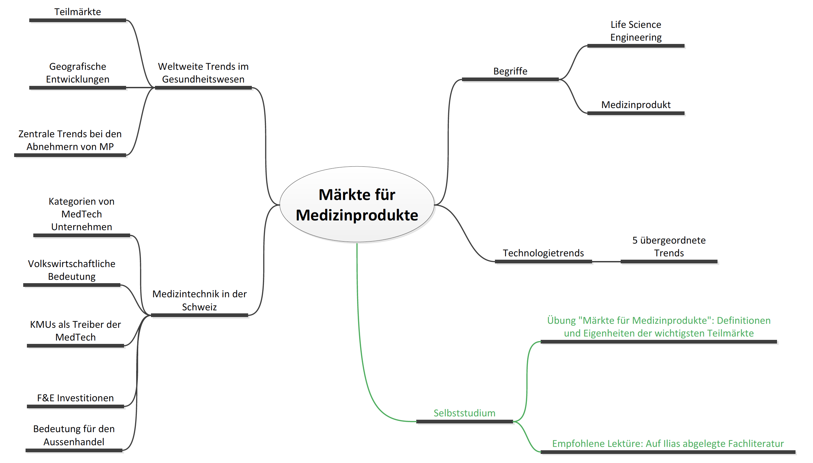

##2. Grundlagen der Sterilisation
###Begriffe

* **Infektion**: Eindringen von Mikroorganismen in einem Makroorganismus und anschliessende Vermehrung der Mikroorganismen.
* **Desinfektion**: Gezieltes Abtöten oder REduzieren von Mikroorganismen an und in kontaminierten Objekten; vom Objekt kann keine Infektion mehr ausgehen. Allgemeine Anforderung: Verminderung der Keimzahl um 4-5 Zehnerpotenzen.
* **Sterilisation**: Elimination aller Formen lebensfähiger Mikroorganismen, so dass der Zustand "steril" erreicht wird. Die theoretische Wahrscheinlichkeit, dass sich ein lebensfähiger Mikroorganismus auf einem als "steril" bezeichneten Produkt befindet, muss kleiner als in einer Million Produkten sein (**EEN556-1**). Typisch Verminderung der widerstandsfähigsten Mikroorganismen um 12 Zehnerpotenzen.

###Mikroorganismen

**Bakterien**

* meist einzellige Kleinlebewesen
* Vermehrung: im Allgemeinen durch Zellteilung
* Typische Grösse: 0.6 - 5 μm
* Einige Bakterien bilden unter ungünstigen Umweltbedingungen **Sporen**: Dauerform, ruhendes Überlebensstadium. Erhöhte Resistenz gegen Hitze und Chemikalien.

**Viren**

* in den meisten Fällen Krankheitserreger
* können sich nicht eigenständig vermehren, sondern sind auf Wirtszellen angewiesen
* Typische Grösse: 18 - 350 nm

**Pilze**

* Besitzen einen vollständigen Zellkern (im Unterschied zu Baktierien)
* Anders als Pflanzen: nicht zur Photosynthese fähig (fehlendes Chlorophyll)
* Etwa 300 der 100'000 bekannten Pilzarten sind für den Menschen krankheitserregend

**Prionen**

* kleinste proteinhaltige infektiöse Partikel
* bestehen aus einem Protein, keine Nukleinsäure als Träger von Erbinformationen
* keine Lebewesen; organische Gifte
* Virusähnliche Eigenschaften
* Äusserst resistent gegen Hitze, Strahlen, Chemikalien und Gase
* Sind 1996 nach dem Auftreten einer neuen Variante der Creutzfeld-Jakob-Krankheit ("Rinderwahnsinn") in den Fokus der Krankenhaushygiene gerückt

####Empfindlichkeit gegenüber Desinfektionsmittel / Sterilisation

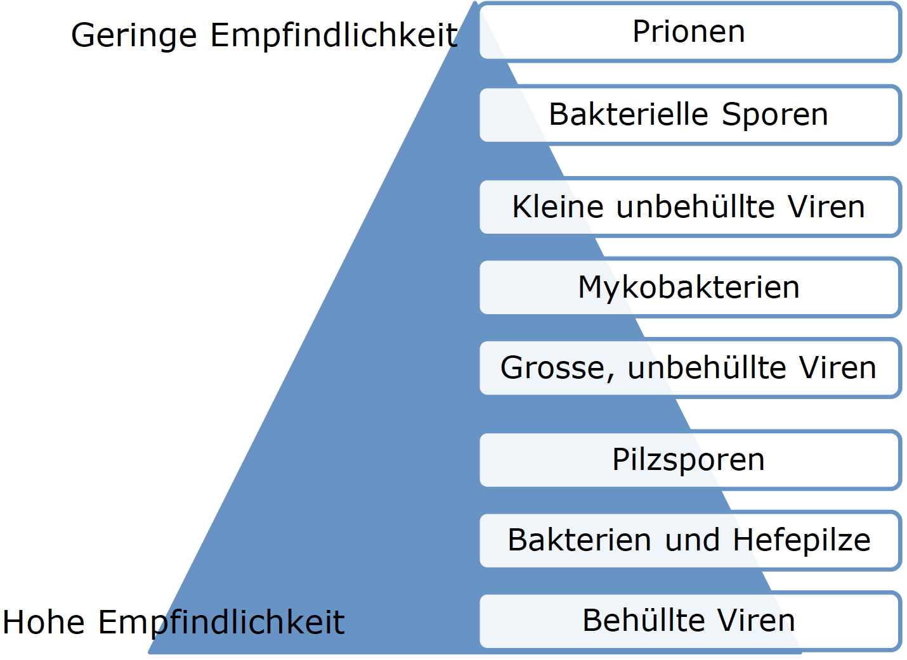

###Infektionsprävention

**Abläufe / Prozesse beim Anwender:**

* Re-Sterilisierbare Produkte
* Einmalgebrauchs-Produkte (single-use / Disposables)

**Instrumentenkreislauf im Spital / in der Arztpraxis für wiederverwendbare, sterilisierbare Instrumente:**

1. Reinigung
2. Desinfektion
3. Inspektion
4. Verpacken
5. Sterilisation
6. Transport
7. Lagern
8. Gebraucht
9. Rücktransport -> danach wieder Reinigung usw.

**Prozess für Instrumente für den Einmalgebrauch (single-use):**

Beim Hersteller:

1. Herstellung
2. Evtl. Reinigung / Desinfektion
3. Verpacken
4. Transport
5. Sterilisieren
6. Transport

Beim Verwender:

6. Transport
7. Lagern
8. Gebrauch
9. Entsorgung

**Klassifizierung der Sterilisationsmethoden:**

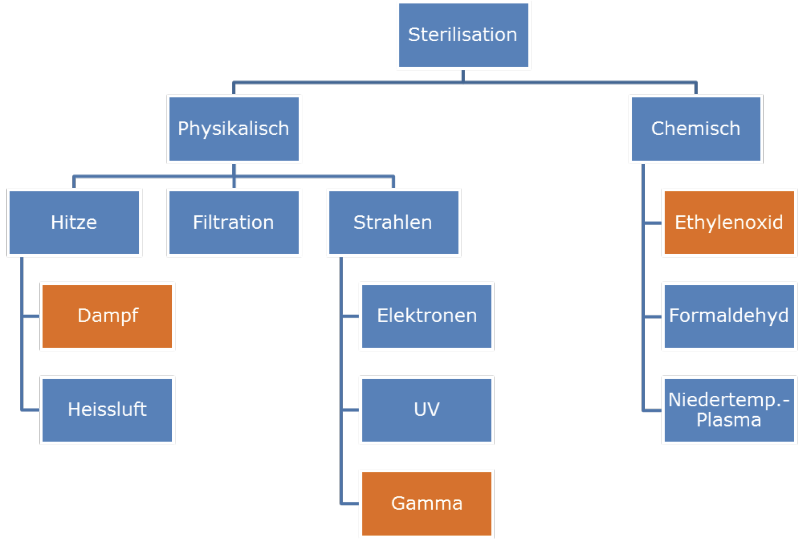

###Sterilisationsmethoden

####Dampfsterilisation

**Wirkungsweise**: Überhitzter Wasserdampf kondensiert am Sterilisationsgut und gibt Kondensationswärme ab. Anhaftende Mikroorganismen werden durch die hohen Temperaturen inaktiviert.

Pro | Contra
:--|:--
häufigste Sterilisationsmethode, insbesondere für wiederverwendbare Produkte | Hohe Temperaturen für viele Materialien ungeeignet. Insbesondere Kunststoffe
Oft verwendete Parameter: 134 Grad Celsius, während 3 Minuten | Dampf muss sämtliche Oberflächen erreichen. Kann insbesondere bei langen, sehr dünnen Kanülen schwierig sein.
Ungefährliche und umweltverträgliche Stoffe (Wasser) |

####Ethylenoxid-Sterilisation

**Wirkungsweise:** Ethylenoxid (EO; Summenformel: C2H4O) verbindet sich mit den Eiweissmolekülen (Proteinen) von Bakterien und Viren und bei ausreichender Befeuchtung auch von bakteriellen Sporen.

Pro | Contra
:--|:--
Sehr geeignet für single-use Produkte aus Kunststoff | EO ist toxisch und kanzerogen beim Einatmen
Oft verwendete Parameter: 55 Grad Celsius, Einwirkdauer wird für jedes Produkt experimentell ermittelt | Praktisch nur in industriellen Anlagen verfügbar -> nicht geeignet für wiederverwendbare Produkte
EO durchdringt viele Kunststoffe; erreicht damit auch kleine Hohlräume des Medizinproduktes | Nach der Sterilisation: relativ lange Ausgasungszeiten

####Gamma-Sterilisation

**Wirkungsweise:** Die hochenergetischen Photonen (λ < 0.1nm) zerstören die DNA und andere Zellstrukturen entweder durch die direkte Einwirkung oder durch Bildung von Radikalen in der Umgebung, die dann ihrerseits mit der DNA reagieren. Die Mikroorganismen werden damit agetötet oder sind nicht mehr fähig zur Reproduktion.

Pro | Contra
:-- |:--
Sehr geeignet für single-use Produkte | Gewisse Werkstoffe, auch Kunststoffe, reagieren mit der Strahlung
Nur ein Prozessparameter: Einwirkungsdauer; abhängig von der Strahlungsquelle und vom Produkt | Praktisch nur in industriellen Anlagen verfügbar -> nicht geeignet für wiederverwendbare Produkte
Sterilisation bei Raumtemperatur | Hohe Investitionskosten für die Sterilisationsanlagen
Gammastrahlung hat eine hohe Eindringtiefe | 

###Konstruktion / Materialien

**Grundsatz 1:** Das sterilisierende Medium muss alle Oberflächen des Medizinproduktes in der vorgegebenen Zeit in ausreichendem Ausmasse erreichen können.

Vorsicht vor:

* Langen Hohlräumen mit geringen Durchmessern
* Porösem Material
* Ein- oder beidseitig abgeschlossenen Hohlräumen

**Grundsatz 2:** Die Materialien müssen verträglich sein mit dem Sterilisationverfahren

####Verpackung

* **Papier, Vlies, Tyvek (permeabel)**: Durchlässig für das Sterilisationsmedium (Dampf, ETO...); undurchlässig für Mikroorganismen
* **Kunststofffolie (impermeabel)**: undurchlässig für Mikroorganismen
* **Siegelnaht**: Durchgängig, reproduzierbar, stellt sterile Entnahme des Produktes sicher
* **Indikatoren**: Zeigen an, ob der entsprechende Sterilisationsprozess durchlaufen wurde. Zeigt nicht an, ob das Produkt steril ist!

###Rückblick Grundlagen der Sterilisation

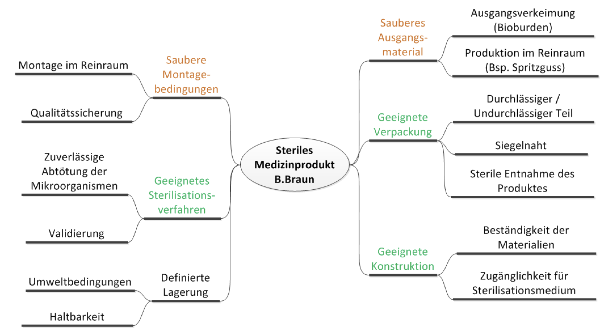

##3. Medizinische Grundlagen

###Absicht der Medizintechnik

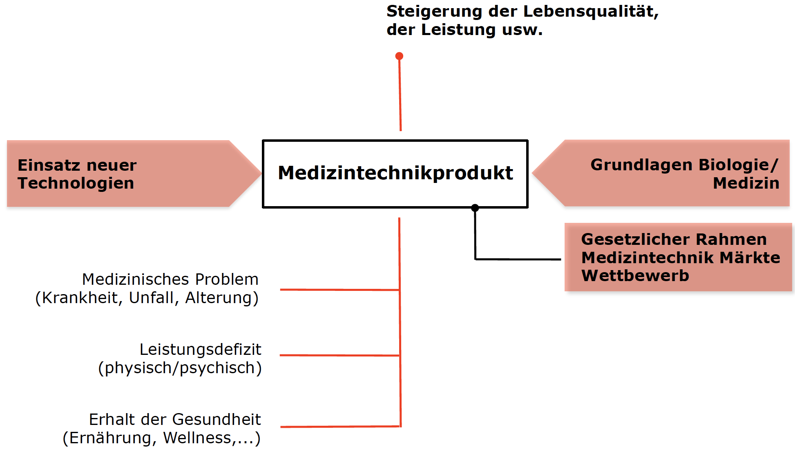

###Einführung

**Blutzucker**: Glucosespiegel im Blut

**Insulin**: Lebenswichtiges Hormon der Bauchspeicheldrüse. Es senkt den Glucosespiegel indem es andere Körperzellen dazu anregt, Glukose aus dem Blut aufzunehmen.

**Glucose**: Energielieferant des Körpers, des Gehirns, der roten Blutkörperchen und des Nierenmarks.

**Überzuckerung (Werte über 99 mmol/L)**: Symptome sind Müdigkeit, Schlappheit, Appetitlosigkeit, starker Durst, vertiefte Atmung, spöter Bewusstlosigkeit mit trochener, warmer und geröteter Haut. Bei dauerhaft erhöhtem Blutzuckerwert kann es sich um Diabetes mellitus handeln.

**Unterzuckerung (Werte unter 70 mmol/L)**: Führt vielfach zu einer verminderten Hirnleistung, Krampfanfällen, eine vermehrte Adrenalinausschüttung und zitterigen Händen sowie Schweissausbrüchen. In ausgeprägter Form kann die Unterzuckerung in einem Schock enden.

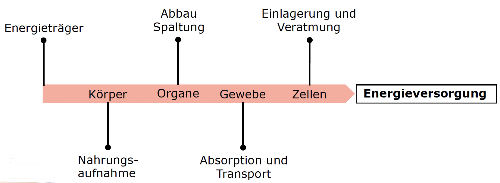

**Charakteristiken des Lebens sind:**

* Wachstum
* Bewegung
* Umwandlung von Energie
* Metabolismus
* **"Selbstunterhalt" (Autopoiesis)**
* ...

**Bestandteil der Autopoiese: Körperhomöostase**: Beispiele von kontrollierten Parametern:

* Temperatur
* Osmose Level
* Blutdruck
* Wasserkonzentration
* O2, CO2 - Regulation
* Schlaf
* **Blutzuckerspiegel**

> **Homöostase:**
> Aufrechterhaltung des Gleichgewichtszustandes eines offenen dynamischen Systems durch einen internen regelnden Prozess

###Ernährung

####Energiestoffwechsel

**Stoffwechsel (Metabolismus)**

* **Anabole Reaktionen** (**Aufbau** körpereigener Stoffe aus einfachen Bausteinen unter Energieverbrauch)
* **Katabole Reaktionen** (**Abbau** von chem. komplexen Nahrungsstoffen zu einfacheren Stoffen zur Energiegewinnung. Handelt es sich dabei um eine chemische Stoffumsetzung, so wird diese Chemotrophie genannt. Wird hingegen Sonnenlicht benötigt, so handelt es such um Phototrophie)

####Energiebilanz

Energiebedarf im Gleichgewicht mit Energiedeckung

**Kohlenhydrate (Zucker und Stärken)**: Dienen zur schnellen Energieversorgung

**Eiweisse (Proteine)**: Werden zu körpereigenen Stoffen umgebaut und liefern Aminosäuren. Viele Aminosäuren können synthetisiert werden, andere sind essentiell.

**Fette (Lipide)**: Öle und Fette haben gegenüber Kohlenhydraten und Proteinen einen doppelten brennwert und sind somit ideal als Energielieferant / Energiespeicher.

**Vitamine**: Für den Stoffwechsel wichtige Verbindungen.

**Grundumsatz:**

Beeinflussende Faktoren: Alter, Geschlecht, Grösse, Gewicht, Stress, Gesundheitszustand usw. Richtwerte: 25-51 Jahre, 74kg (m) und 59kg (w) = **1'740** kcal/Tag (m) und **1'340** kcal/Tag (w).

**Leistungsumsatz:**

Abhängig von Ausmass der körperlichen Aktivität änder sich der "PAL" (physical activity level): Faktor 1,4 - 1,5 für Büroangestellte und 2,0 - 2,4 für Bauarbeiter, Landwirte usw.

####Kohlenhydrate (Saccharide)

Kohlenhydrate / Saccharide können aufgrund der chemischen Formel in vier Gruppen eingeteilt werden: Mono-, Di-, Oligo- und Polysaccharide.
Neben der Funktion als Energieträger sind Kohlenhydrate wichtig als Stützsubstanzen vor allem im Pflanzenreich und in biologischen Signal- und Erkennungsprozessen (z.B. Zell-Zell-Erkennung, Blutgruppen).

 |Zucker |Beispiele
 :-- |:-- |:--
Monosaccharide (Einfachzucker) |Glucose (Traubenzucker), Fructose (Fruchtzucker) |Obst, Honig
Disaccharide (Zweifachzucker) |Saccharose (Rohrzucker), Maltose (Malzzucker), Lactose (Milchzucker) |Reg. Zucker, Malzbier, Milch
Oligosaccharide (Mehrfachzucker [<= 10]) |Maltotriose, Dextrine |Toast, Zwieback, Knäckebrot, Sportnahrungskonzentrate
Polysaccharide (Vielfachzucker [10 - 100'000]) |Stärken (pflanzlich), Glykogen (tierisch) |Getreide, Brot, Nudeln, Reis, Kartoffeln

####Eiweisse (Proteine)

Es sind 23 verschiedene Aminosäuren (proteinogen) bekannt, die aneinandergereiht unterschiedlichste Proteine bilden. Die Reihenfolge der Aminosäuren entscheidet dabei über die biologische Funktion der Proteine. 

Proteine haben einen enorm breiten "Einsatzbereich". Sie übernehmen mechanische Funktionen (Fingernägel, Haare, Muskelzellen) oder agieren als Katalysatoren bei biochemischen Prozessen (Enzyme). Andere Proteine sind wichtig als Signalmolekül (Hormone), bei der Immunreaktion, Gewebebildung usw.

Die räumliche Struktur definiert die Wirkungsweise der Proteine. Man unterscheidet in primäre, sekundäre und tertiäre Struktur.
Das grösste bekannte menschliche Protein ist Connectin / Titin (Muskel) und besteht aus über 30'000 Aminosäuren.

####Fette und Öle (Lipide)

Unter Lipiden versteht man eine sehr diverse Gruppe von Molekülen, die in sieben Kategorien eingeteilt werden können (Fettsäuren, Fette und Öle, Wachse, Phospholipide, Sphingolipide, Lipopolysaccharide und Isoprenoide, Steroide usw.). 

Sie bestehen meist aus einer polaren, hydrophilen Kopfgruppe und einem lipophilen Kohlenwasserstoff-Rest (sind meistens schwer in Wasser löslich).

Die hauptsächliche biologische Funktion besteht aus Energieträger, Bildung der Zellmembran und als Botenstoff.

####Vitamine

Als Vitamine bezeichnet man organische Verbindungen, die für viele lebenswichtige Funktionen benötigt werden, die der Stoffwechsel jedoch nicht bedarfsdeckend synthetisieren kann. SOmit müssen einige Vitamine mit der Nahrung aufgenommen werden und sind somit essentiell.

Unterteilt werden die Vitamine in **fettlöslich** (lipophile) und **wasserlöslich** (hydrophile). Sie kommen in der unbelebten Natur nicht vor und müssen erst von Pflanzen, Bakterien oder Tieren gebildet werden. Beim Menschen kann man von 13 organischen Verbindungen sprechen, die als Vitamine gelten (davon sind 11 essentiell).

###Verdauungsorgane

**Mundhöhle**

Aufnahme der Nahrung, Zerkleinerung, Umwandlung in Speisebrei und Weitertransport. Durch die **im Speichel enthaltenen zuckerspaltenden Enzyme** beginnt die Verdauung bereits im Mund.

**Magen**

Chemische Zerkleinerung des Speisebreis. Der Speisebrei wird nach ca. 1 - 5 Stunden Verweildauer in den Dünndarm weitergeschoben.

**Darm**

Unterteilt in Dünndarm und Dickdarm findet dort die Verdauung und die Rückresorption von Wasser und Salzen statt.

####Magen (Ventriculus, Gaster)

**Funktion:** Chemische Zerkleinerung und Verflüssigung der Nahrung durch den stark sauren (pH 1.5 - 2) Magensaft.

**Gastrinsekretion (Hormon)** stimuliert durch das Eintreten von Nahrung in den Magen -> **Magensaft** Aus: Wasser, Schleim, Salzsäure und eiweissspaltenden Enzymen (Pepsin).

Auffaltungen der Magenschleimhaut bildet Magenfalten, auf denen Magengrübchen (Foveolae gastricae) lokalisiert sind. In jedem Grübchen münden Magendrüsen.

**Magendrüse:** Pepsinogen wird durch Salzsäure in die aktive Form Pepsin umgewandelt.

####Bauchspeicheldrüse (Pancreas)

Exokrine Drüse, die bis zu 2 Liter alkalischen Pankreassaft pro Tag produziert. Im Zwölffingerdarm ausgeschüttet neutralisiert er dort das saure Milieu.

Der Pankreassaft enthält zahlreiche Enzyme zur **Fettverdauung** (Lipasen wie bsp. Phosphilipase A), **Eiweissverdauung** (Proteasen wie bsp. Trypsin, Chymotrypsin) und **Kohlenhydratverdauung** (Amylasen). Die Enzyme werden als Vorsufen ausgeschüttet, die durch das saure Milie in die aktive Form umgewandelt werden -> **Exokrine Sekretion**

Im Inselapparat der Bauchspeicheldrüse werden Hormone zur Regulation des Blutzuckers (Insulin und Glukagon) gebildet -> **Endokrine Sekretion**

Stimulus zur Ausschüttung des Pankreassafts sind a) Fette und b) niedriger pH des ankommenden Speisebreis.

####Leber (Hepar)

Ist mit rund 1.5 - 2 kg die grösste Drüse des Menschen. Pro Minute fliessen 1.5 Liter arterielles Blut durch das Organ. Als **Stoffwechselorgan** übernimmt sie wichtige Funktionen des Kohlenhydrat-, Eiweiss- und Festtstoffwechsels sowie der Entgiftung. Die **Gallensäure** der Gallenflüssigkeit emulgiert im Darm Fette und ermöglicht dadurch die Resorption. Die im Darm resorbierten Nährstoffe gelangen über die Pfortader (V. portae) in die Leben. **Kohlenhydrate** als Glykogen werden gespeichert und bei Bedarf wieder abgegeben. 

##4. Biokompatibilität

**Biomaterial / Implantatmaterial**: synthetische oder nichtlebende natürliche Materialien oder Werkstoffe, welche für therapeutische oder diagnostische Zwecke eingesetzt werden und in unmittelbaren Kontakt mit biologischem Gewebe des Körpers kommen. Diese Materialien treten dabei in chemische, physikalische und biologische Wechselwirkungen mit den entsprechenden biologischen Systemen.

**Biokompatibilität**: Fähigkeit eines Werkstoffes, in einer spezifischen Anwendung bei angemessener Wirtsreaktion eine bestimmte Funktion auszuüben.

Implantat-Eigenschaften |Gewebereaktion
:--|:--
toxisch|Gewebenekrose
inert|Gewebe bildet eine nicht-adhärente Bindegewebekapsel um das Implantat
bioaktiv|Gewebe bildet eine Bindung mit dem Implantat aus
degradabel|Gewebe ersetzt Implantat

* **Toxisches** Implantat: Langzeitschäden auf genetisches Material etc.
* **Inertes** Implantat: hartes Bindegewebe isoliert den Fremdkörper
* **Bioaktives** Implantat: Bsp. Knochen wächst ein
* **Degradables** Implantat: Bsp. Fixierung, welche durch das Gewebe ersetzt wird

###Biokompatible Werkstoffe

####Metalle

**Rostfreie Stähle**: Typisch: 315L (hochlegierter Chrom-Nickel-Stahl), Implantate, chirurgische Instrumente

**Kobaltlegierungen**: CoCrMo / CoCrWNi / CoNiCrMo; Gelenkersatz, Fixation von Knochenbrüchen, künstliche Herzklappen

**Titanlegierungen**: Reintitan oder Legierungen mit höherer Festigkeit, Implantate, chirurgische Instrumente

####Polymere

**Anforderungen an Polymere für die Medizintechnik:**

->|->
:--|:--
-> Endprodukt | Bioverträglich
Grundmaterial und Zusätze (z.Bsp. Farbgranulate) | Bioverträglichkeit in der spezifischen Zusammensetzung testen; Zusammensetzung sicherstellen
Spritzguss| Unter Reinraumbedingungen, Trennmittel
Sterilisation | Dampf- und Gammasterilisation nur eingeschränkt möglich
Einsatzspezifische Anforderungen|Festigkeit, Formgebung, ...

####Biologische Gefährdungen durch Medizinprodukte

#####Kurzzeiteffekte

Bezeichung|Beschreibung|Beispiel
:--|:--|:--
Akute Toxizität|Giftige Wirkung aufgrund einmaliger Einwirkung|Giftige Wirkung auf Zellen, Nervenzellen, Leben, Nieren, Blut
Irritation|Reizung, Entzündungsreaktion|Hautreizung, Augenreizung
Hämolyse|Auflösung der roten Blutkörperchen|Werkstoffbedingt oder strömungsbedingt
Thrombogenität|Bildung eines Blutgerinnsels|Oberfläche des Implantates wirkt auf das Blut wie eine Verletzung

#####Langzeiteffekte

Bezeichung|Beschreibung|Beispiel
:--|:--|:--
Chronische Toxizität|Giftige Wirkung aufgrund kontinuierlicher Einwirkung|Giftige Wirkung auf Zellen, Nervenzellen, Leber, Nieren, Blut
Allergie|Überreaktion des Immunsystems|Pollenallergie
Sensibilisierung|Aufbau einer fehlgeleiteten spezifischen Immunantwort bei Erstkontakt|Zweitkontakt mit Werkstoff kann Allergie auslösen; Nickelallergie
Genotoxizität|Veränderungen im genetischen Material|Bsp. mit metallenem Hüftgelenk, welches Langzeitschäden hervorrufen kann
Karzinogenität|krebserregend|Phthalate (Weichmacher) in Kunststoffen
Reproduktionstoxizität|Beeinträchtigung der Fortpflanzungsfähigkeit, Schädigung des Embryos|Phthalate (Weichmacher) in Kunststoffen

###Rückblick Biokompatibilität

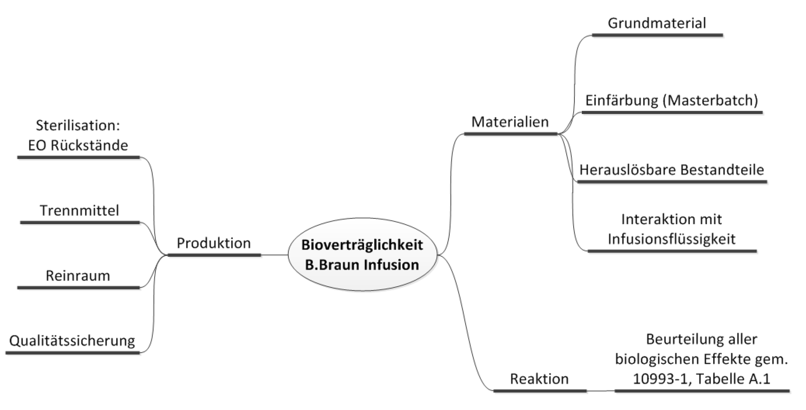

##5. Regulatorische Anforderungen
###Rechtliche Grundlagen

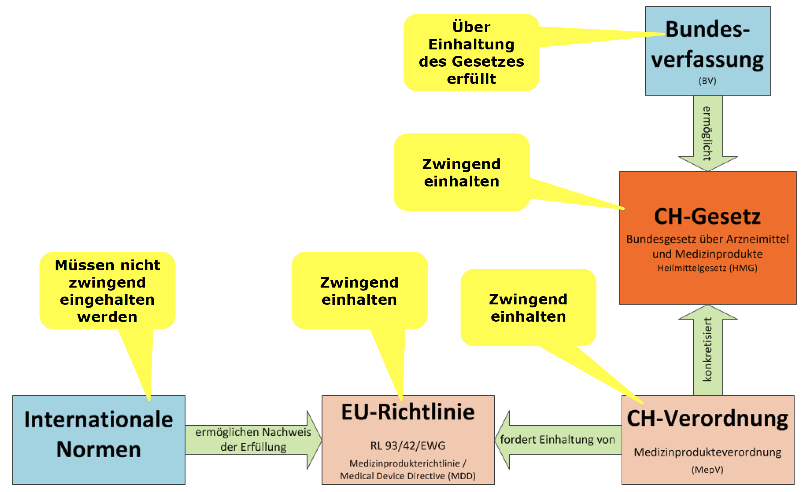

####Bundesverfassung (BV)

>**Art. 95		Privatwirtschaftliche Erwerbstätigkeit***
> 
>1. Der Bund kann Vorschriften erlassen über die Ausübung der privatwirtschaftlichen Erwerbstätigkeit

>**Art. 118 	Schutz der Gesundheit**
>
>1. Der Bund trifft im Rahmen seiner Zuständigkeiten Massnahmen zum Schutz der Gesundheit.
>
>2. Er erlässt Vorschriften über:
>
>a. den Umgang mit Lebensmitteln sowie mit Heilmitteln, Betäubungsmitteln, Organismen, Chemikalien und Gegenständen, welche die Gesundheit gefährden können;
>
>b. die Bekämpfung übertragbarer, stark verbreiteter oder bösartiger Krankheiten von Menschen und Tieren;
>
>c. den Schutz von ionisierenden Strahlen.

####Heilmittelgesetz (HGM)

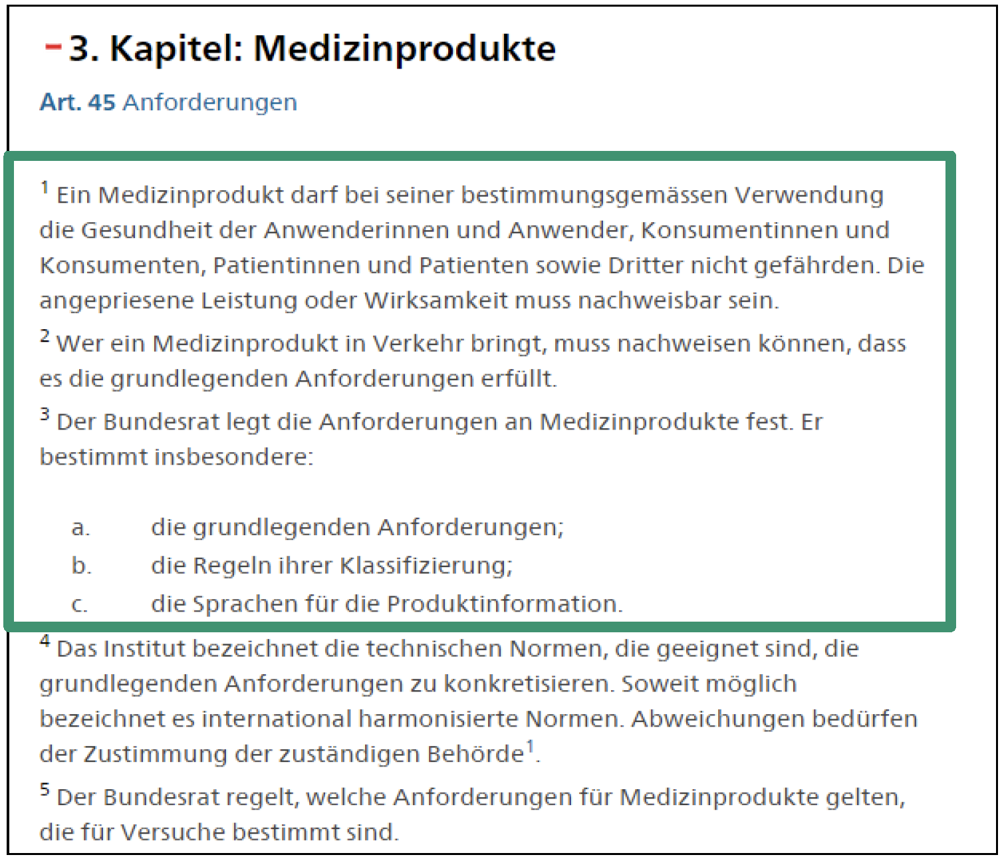

####Medizinprodukteverordnung (MepV)

>**Art. 4 Anforderungen an Medizinprodukte**
>
>1. Die grundlegenden Anforderungen nach Artikel 45 Absatz 2 HMG sind festgelegt für:
>
>a. klassische Medizinprodukte: in Anhang der Richtlinie 93/42/EWK des Rates vom 14. Juni 1993 über Medizinprodukte (Richtlinie 93/42/EWG);

####International

* Medizinprodukte, welche die schweizerischen Regularien erfüllen, dürfen ohne weitere Hürden im gesamten EU-Raum in Verkehr gebracht werden.
* Alle anderen Länder: das Inverkehrbringen unterliegt den jeweiligen lokalen Gesetzen!
* Ähnliche Anforderungen (safety & effectiveness), aber formell grosse Unterschiede
* Wichtigste Länder: USA, Japan, Kanada, Brasilien, China...

###Anforderungen der Medizinprodukterichtlinie

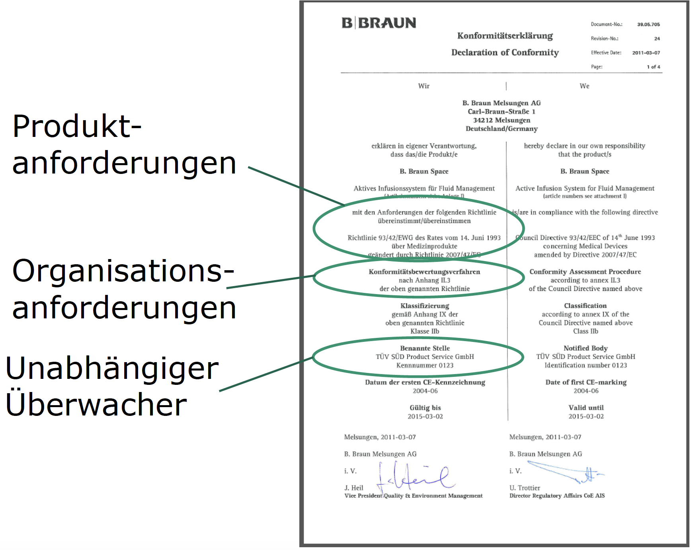

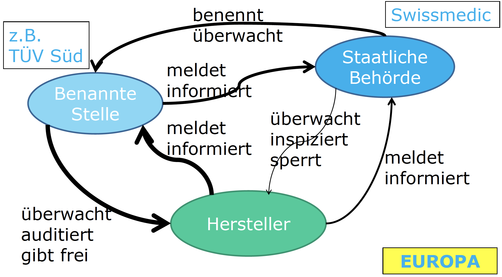

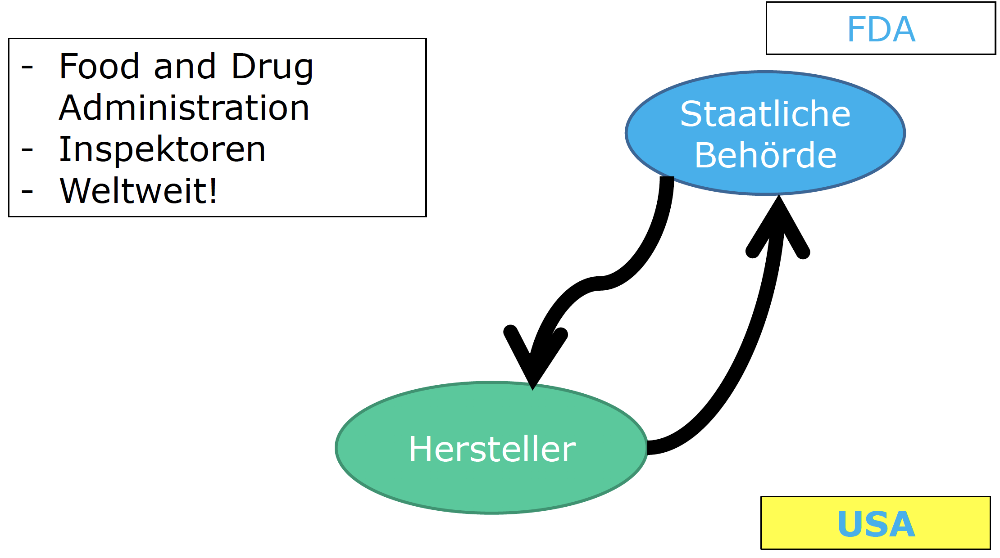

**RL 93/42/EWG**:
zusammengesetzt aus Produktanforderungen und Organisationsanforderungen

###Produktanforderungen (ISO 9001)

I. Allgemeine Anforderungen

II. Anforderungen an die Auslegung und die Konstrukttion:

* Chemische, physikalische und biologische Eigenschaften
* Infektion und mikrobielle Kontamination
* Eigenschaften im Hinblick auf die Konstruktion und die Umgebungsbedingungen
* Produkte mit Messfunktion
* Schutz vor Strahlungen
* Anforderungen an Produkte mit externer oder interner Energiequelle
* Bereitstellung von Informationen durch den Hersteller

**Ablauf**: Versuchsaufbau, Versuchsablauf, Berechnungsformeln

###Organisationsanforderungen (ISO 13485)

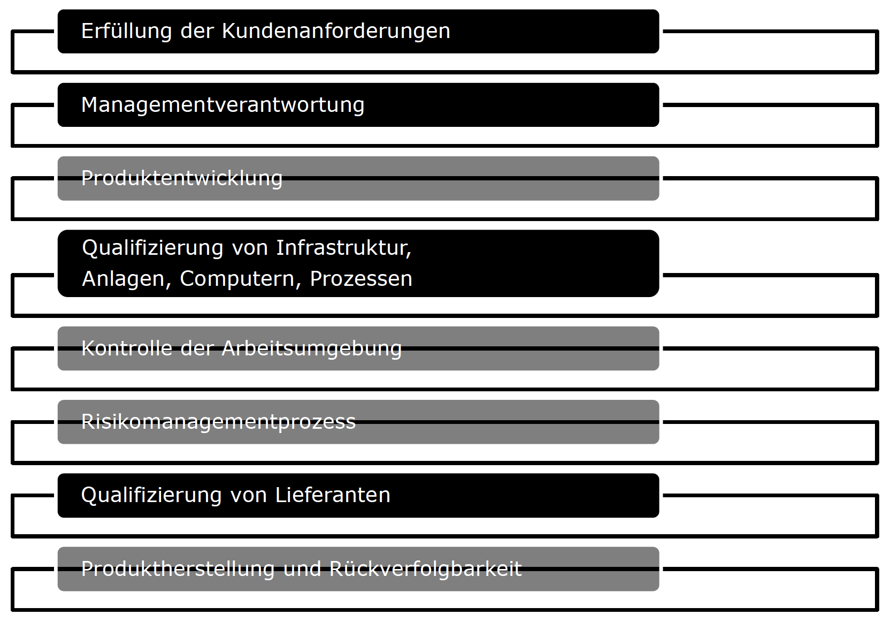

####Erfüllung der Kundenanforderungen

* Anforderungen: explizit, implizit, gesetzliche
* Fehlerhafte Produkte: erfüllen Anforderungen nicht: Prozesse für Korrektur- und Vorbeugemassnahmen (CAPA: Corrective and Preventive Actions)
* Prozess für Kundenreklamationen
* Bei "Ereignissen": Prozess zur Meldung des Ereignisses an die Behörden

####Managementverantwortung

* Mgmt. stellt Verfügbarkeit von Ressourcen sicher
* Mgmt. legt fest und dokumentiert Verantwortungen und Befugnisse
* Mgmt. stellt sicher, dass die beschriebenen Prozesse verwirklicht und eingehalten werden

####Qualifizierung von Infrastruktur, Anlagen, Computern und Prozessen

* Entweder: Ergebnis verifizieren oder Prozess validieren
* Nicht zwingend zu validieren: Prozesse, deren Ergebnis nachfolgend verifiziert werden können
* Validierung der Anwendung von SW, die für Produktion oder Dienstleistungserbringung eingesetzt wird

####Qualifizierung von Lieferanten

* Die Organisation muss Lieferanten auf Grund von deren Fähigkeit beurteilen und auswählen
* Es müssen Kriterien für die Auswahl, Beurteilung und Neubeurteilung aufgestellt werden
* Aufzeichungen über die Ergebnisse von Beurteilungen und über notwendige Massnahmen müssen geführt werden

####Warning Letters von der FDA 2013 und 2014

Reihenfolge der Beanstandungen:

1. Korrektur- und Vorbeugeprozesse
2. Reklamationsprozesse
3. Entwicklungsprozesse

* Alle Tätigkeiten, welche die Produktqualität direkt oder indirekt beeinflussen können, müssen beschrieben sein
* Beschriebene und gelebte Prozesse müssen übereinstimmen
* Die Prozesse und die Ergebnisse der Prozesse müssen überwacht und dokumentiert werden
* Fehler müssen analysiert werden und Massnahmen gegen wiederholtes Auftreten der Fehler müssen umgesetzt werden
* Die Mitarbeiter müssen zu den ihnen zugewiesenen Tätigkeiten befähigt sein

###Zusammenfassung Regulatorische Anforderungen

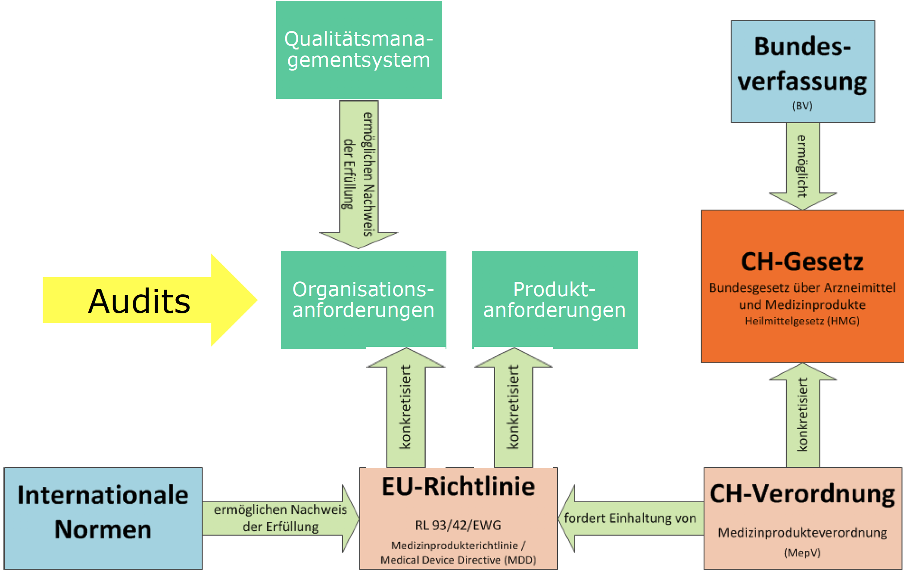

##6. Entwicklungsprozesse

###Entwicklungsprozess bei B.Braun

###Design Transfer

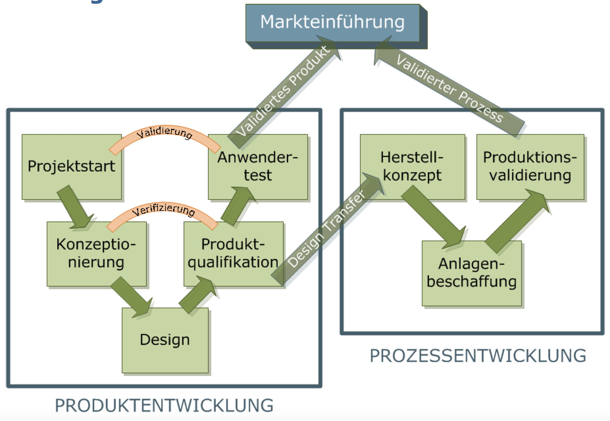

###Entwicklungssystematik

**Entwicklungsverifizierung**: Nachweis, dass die Entwicklungsergebnisse die Entwicklungsvorgaben erfüllen.

**Entwicklungsvalidierung**: Nachweis, dass das resultierende Produkt in der Lage ist, die Anforderungen für die festgelegte Anwendung oder den beabsichtigten Gebrauch zu erfüllen.

####Design-Reviews

* Prozess für Reviews muss implementiert sein
* Nicht nach jeder Entwicklungsphase erforderlich
* Reviewer: Vertreter beteiligter und betroffener Bereiche; FDA: mindestens ein "independent reviewer" (weder beteiligt noch betroffen)
* Reviews müssen dokumentiert werden

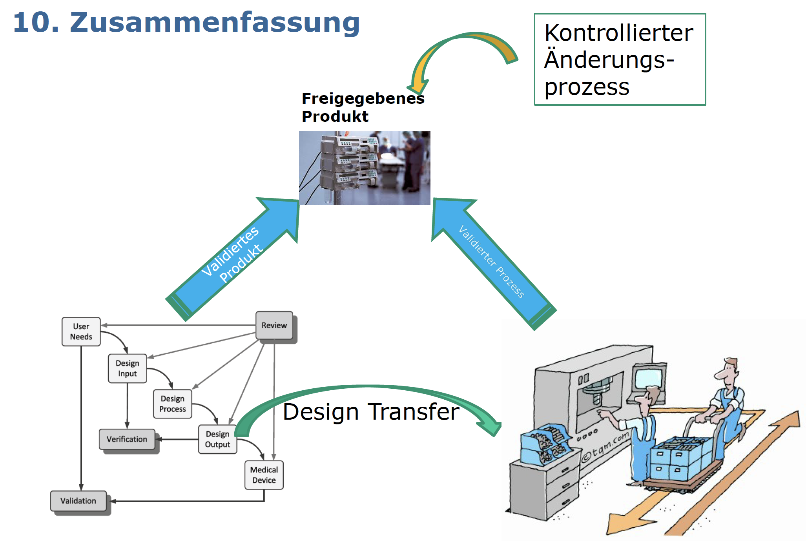

##7. Risikomanagement / Gebrauchstauglichkeit

Gefährdung (spitze Hörner)

-> Gefährdungssituation (Mutterkuh & Wanderer)

-> Risikobehebung (Integrierte Sicherheit / Schutzmassnahmen / Informationen)

* **Effektivität**: Kann das Ziel mit dem Produkt vollständig erreicht werden?
* **Effizienz**: Mit welchem Aufwand wird dieses Ziel erreicht?
* **Zufriedenheit**: Welche Reaktion löst das Produkt beim Anwender aus - stört oder unterstützt es?

###Entwicklung gebrauchstauglicher Produkte

* Interdisziplinärer Ansatz
* Entwicklung der Mensch-Maschine-Schnittstelle parallel zur Technologie
* Anwender nicht nur befragen, sondern auch bei der Arbeit beobachten
* Funktionsüberflutung und Komplexität der Geräte vermeiden

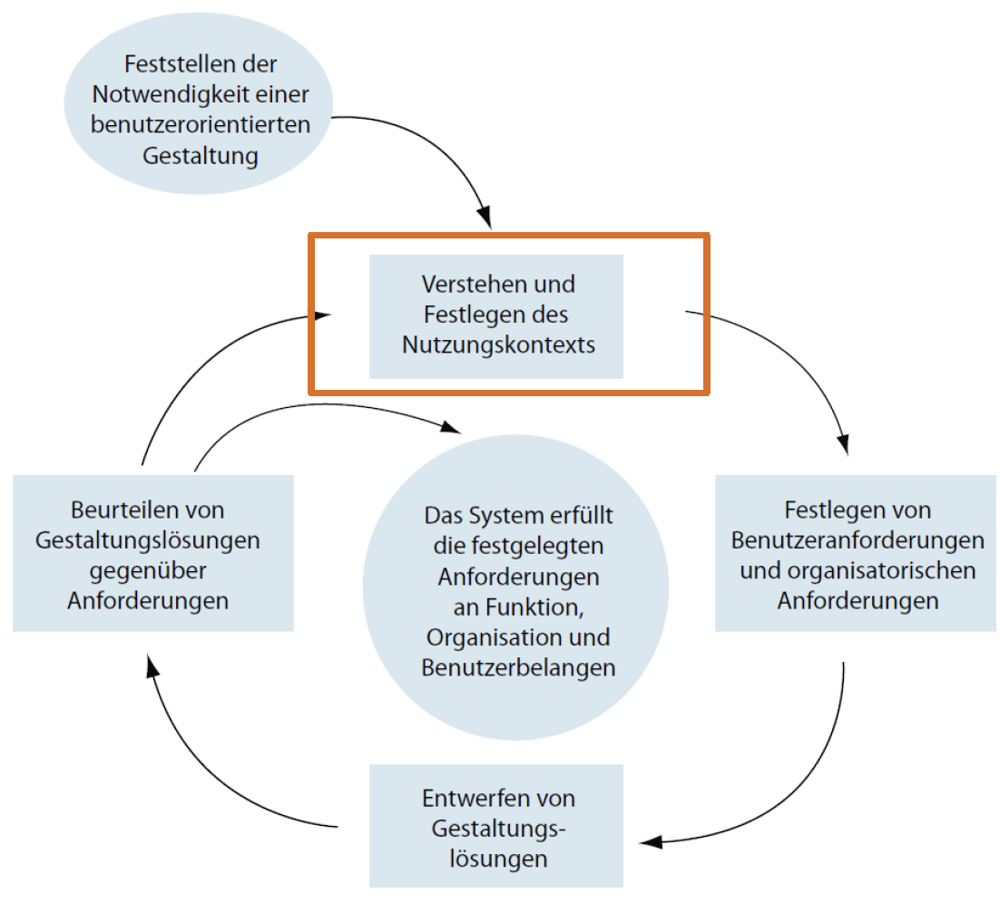

* Fokusgruppen
* Feldbeobachtungen
* Cognitive Walkthrough

* Was wird in der medizinischen Anwendung wirklich gebraucht?
 * **Haupt- / Primärfunktionen**
* Welche unterstütztenden Funktionen sind dafür notwendig?
 * **Sekundärfunktionen**

* Paper Prototyping
* Card Sorting (Morphologischer Kasten)

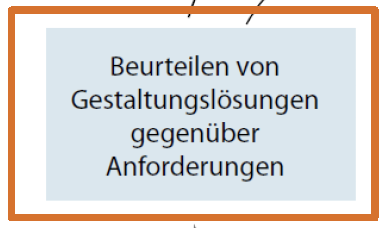

* Dialogprinzipien
* Heuristische Evaluation
* Nutzertests / Usabilitytests
* **Verifizierung und Validierung der Gebrauchstauglichkeit**

**Dialogprinzipien**:

* **Aufgabenangemessenheit**
 * Produkt unterstützt Nutzer seine Aufgabe effizient und effektiv zu erfüllen
 * Werkzeug statt Spielzeug
 * Reihenfolge der Arbeitsschritte entspricht dem Prozess des Nutzers
 * Benennung von Funktionen etc. entspricht der Sprache des Nutzers
* **Selbstbeschreibungsfähigkeit**
 * Für die Benutzer ist zu jeder Zeit offensichtlich, in welchem Dialog und an welcher Stelle im Dialog sie sich befinden, welche Handlungen unternommen werden können und wie diese ausgeführt werden können
 * Aktueller Systemzustand ist sichtbar
 * Information über Erfolg / Misserfolg der gerade durchgeführten Aktion
 * Aktuell mögliche Funktionen
 * Informationen über die erwartete Eingabe
 * Begriffe aus der Welt der User
 * Online-Hilfe
* **Steuerbarkeit**
 * Ein Produkt ist steuerbar, wenn der Benutzer in der Lage ist den Arbeitsablauf zu starten, sowie seine Richtung und Geschwindigkeit zu beeinflussen
 * Der Nutzer ist Herrscher über den Dialog
 * Keinen bestimmten Arbeitsrhythmus aufzwingen
 * Abfolge der Arbeitsschritte so wenig wie möglich vorgeben
* **Erwartungskonformität**
 * Der Dialog entspricht den Kenntnissen des Benutzers aus seinem Arbeitsgebiet, seiner Ausbildung und seiner Erfahrung
 * Möglichst wenige Überraschungen für den User 
* **Fehlertoleranz**
 * Trotz erkennbarer fehlerhafter Eingaben kann das beabsichtigte Arbeitsergebnis mit keinem oder minimalem Korrekturaufwand erreicht werden
 * Fehlervermeidung
 * Prüfung der Daten während der Eingabe (nicht erst bei Übernahme)
* **Individualisierbarkeit**
 * Der Benutzer kann den Dialog an seine Arbeitsaufgabe sowie seine individuellen Fähigkeiten und Vorlieben anpassen
* **Lernförderlichkeit**
 * Der Benutzer wird beim Erlernen der Anwendung unterstützt und angeleitet
 * Hilfesysteme, Tutorials, Betriebsanleitung

